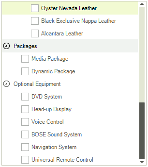
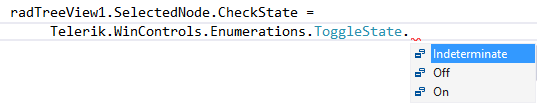
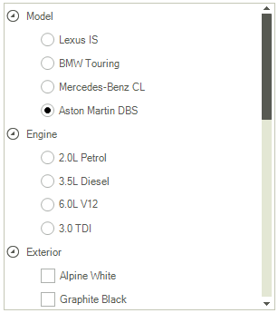

# Using Checkboxes

Enable the check boxes by setting the __CheckBoxes__ property to *true*. By default all nodes display check boxes when the __CheckBoxes__ property is *true*. To suppress showing a checkbox next to a particular RadTreeNode set the node __CheckType__ property to *None*. To check a node programmatically, use the __Checked__ or __CheckState__ properties of RadTreeNode. When the user clicks a checkbox the __NodeCheckChanged__ event fires passing a RadTreeViewEventArgs object that contains the checked Node.

## Tri-State CheckBoxes

Tri-state check boxes in addition to checked and unchecked states also have a "indeterminate" state. To enable this feature set the __TriStateMode__ property to *true*. The screen shot below shows that "Node1" is in __Indeterminate__ state to indicate that its children are not all checked.



>note When __TriStateMode__ is set to true, the __CheckBoxes__ property is also set to true automatically.
>


To programmatically set the state when __TriStateMode__ is true assign the __CheckState__ property one of the __ToggleState__ enumeration values.



## Option Tree Support

__RadTreeView__ the supports option trees that allows radio buttons and check boxes to be mixed in order to form an arbitrary complex option tree. The only limitation is that all sibling nodes must have either check boxes or radio buttons. Check boxes and radio buttons can be mixed in a single __RadTreeNodeCollection__. The __RadTreeNode__ property that control the type of option element to be shown (check box or radio button) is __CheckType:__



{{source=..\SamplesCS\TreeView\WorkingWithNodes\WorkingWithNodes1.cs region=optionList}} 
{{source=..\SamplesVB\TreeView\WorkingWithNodes\WorkingWithNodes1.vb region=optionList}} 

````C#
RadTreeNode Node1 = new RadTreeNode("Node1");
Node1.Expanded = true;
Node1.CheckType = CheckType.RadioButton;
RadTreeNode Node2 = new RadTreeNode("Node2");
RadTreeNode Node3 = new RadTreeNode("Node3");
RadTreeNode Node4 = new RadTreeNode("Node4");
radTreeView1.Nodes.Add(Node1);
radTreeView1.Nodes.Add(Node2);
Node1.Nodes.Add(Node3);
Node1.Nodes.Add(Node4);

````
````VB.NET
Dim Node1 As New RadTreeNode("Node1")
Node1.Expanded = True
Node1.CheckType = ChildListType.OptionList
Dim Node2 As New RadTreeNode("Node2")
Dim Node3 As New RadTreeNode("Node3")
Dim Node4 As New RadTreeNode("Node4")
RadTreeView1.Nodes.Add(Node1)
RadTreeView1.Nodes.Add(Node2)
Node1.Nodes.Add(Node3)
Node1.Nodes.Add(Node4)

````

{{endregion}}

# See Also
* [Adding and Removing Nodes]()

* [Bring a Node into View]()

* [Custom Filtering]()

* [Custom Nodes]()

* [Custom Sorting]()

* [Events]()

