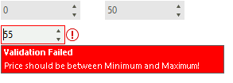
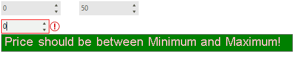

# Customizing Error Indication

When a control is being validated and some of the validation rules fails, a tool tip indicating the error occurs:

 

In addition, the **ControlValidation** event is fired. The **RadValidationEventArgs** offers the following information:

* **ValidationHelperElement**: stores the styling information of the error indication. 
* **IsValid**: determines whether the controls is validated or not. Even though the validation may fail according to the defined rules, you can determine that the situation is valid in certain cases and set it to *true*. 
* **Control**: returns the control being validated. 
* **ErrorImage**: specifies the error image that is being shown when the validation fails.  
* **ErrorSvgImage**: specifies the error vector image that is being shown when the validation fails. It is recommended to set the **ImageLayout** property to *Stretch* to fit the image in an appropriate way. 
* **ToolTip**: gives you access to the error tooltip.
* **ToolTipX** and **ToolTipY**: specifies the location of the tooltip. 
* **ToolTipDuration**: specifies the duration how long the tooltip is being shown. 
* **ValidationRule**: returns the rule that fails. 
* **ErrorText**: specifies the error message. 
* **ErrorTitle**: specifies the error title.
* **DisplayIconAndToolTip**: controls whether to display icon and tooltip.
* **EnableToolTipShadow**: controls whether the tooltip's shadow will be rendered.

The **ToolTip** argument is represented by System.Windows.Forms.[ToolTip](https://docs.microsoft.com/en-us/dotnet/api/system.windows.forms.tooltip?view=netcore-3.1). Hence, in order to change its font, fill color, etc, we will follow a standard approach with enabling the [OwnerDraw](https://docs.microsoft.com/en-us/dotnet/api/system.windows.forms.tooltip.ownerdraw?view=netcore-3.1) property:


{{source=..\SamplesCS\ValidationProvider\ValidationProviderGettingStarted.cs region=CustomizingErrorIndication}} 
{{source=..\SamplesVB\ValidationProvider\ValidationProviderGettingStarted.vb region=CustomizingErrorIndication}}

````C#

private void radValidationProvider1_ControlValidation(object sender, RadValidationEventArgs e)
{
    e.ToolTip = new ToolTip();
    e.ToolTip.OwnerDraw = true;
    e.ToolTip.Draw += ToolTip_Draw;
    e.ToolTip.Popup += ToolTip_Popup;
    toolTipText = e.ValidationRule.ToolTipText;
}

private void ToolTip_Popup(object sender, PopupEventArgs e)
{
    Graphics g = e.AssociatedControl.CreateGraphics();
    Size preferredSize = g.MeasureString(toolTipText, f).ToSize();
    e.ToolTipSize = preferredSize;
    g.Dispose(); 
}

Font f = new Font("Arial", 16.0f);
string toolTipText = string.Empty;
private void ToolTip_Draw(object sender, DrawToolTipEventArgs e)
{
    ToolTip toolTip = sender as ToolTip;
    toolTip.BackColor = System.Drawing.Color.Green;
    e.DrawBackground();
    e.DrawBorder();
    e.Graphics.DrawString(e.ToolTipText, f, Brushes.Pink, new PointF(1, 1)); 
}


````
````VB.NET
Private Sub radValidationProvider1_ControlValidation(ByVal sender As Object, ByVal e As RadValidationEventArgs)
    e.ToolTip = New ToolTip()
    e.ToolTip.OwnerDraw = True
    AddHandler e.ToolTip.Draw, AddressOf ToolTip_Draw
    AddHandler e.ToolTip.Popup, AddressOf ToolTip_Popup
    toolTipText = e.ValidationRule.ToolTipText
End Sub

Private Sub ToolTip_Popup(ByVal sender As Object, ByVal e As PopupEventArgs)
    Dim g As Graphics = e.AssociatedControl.CreateGraphics()
    Dim preferredSize As Size = g.MeasureString(toolTipText, f).ToSize()
    e.ToolTipSize = preferredSize
    g.Dispose()
End Sub

Private f As Font = New Font("Arial", 16.0F)
Private toolTipText As String = String.Empty

Private Sub ToolTip_Draw(ByVal sender As Object, ByVal e As DrawToolTipEventArgs)
    Dim toolTip As ToolTip = TryCast(sender, ToolTip)
    toolTip.BackColor = System.Drawing.Color.Green
    e.DrawBackground()
    e.DrawBorder()
    e.Graphics.DrawString(e.ToolTipText, f, Brushes.Pink, New PointF(1, 1))
End Sub

````

{{endregion}} 

 


# See Also

* [Getting Started]()
* [Validation Rules]()
* [Design Time]()
 
        
