# Design Time

To start using **RadValidationProvider** just drag it from the toolbox and drop it onto the form.

## Smart Tag

Select **RadValidationProvider** and click the small arrow at the top right position in order to open the **Smart Tag**. Open the *FilterDescriptor Collection Editor* by clicking the *Edit Validation Rules* option in the Smart tag.

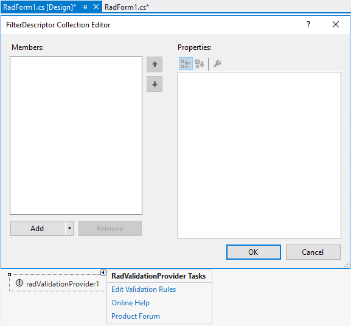 

The different [Validation Rules]() that **RadValidationProvider** offers can be added at design time without the necessity of writing any code once the *FilterDescriptor Collection Editor* is opened. 

## RadValidationRule

**RadValidationRule** allows you to define validation logic for a single control considering a validation operator and a fixed value.

We will add a rule that validates the value in a **RadSpinEditor** and ensures that it is less than *100*: 

1. Add a **RadValidationRule** and select the **RadSpinEditor** control that you want to validate from the **Controls** collection: 

	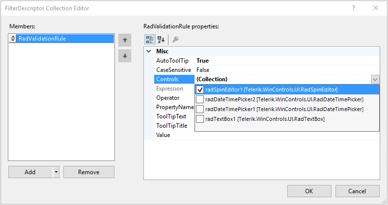 

2. Set the **Operator** to *IsLessThan*, **PropertyName** to *Value*, **ToolTipText** to *"Value should be less than 100!"*:

	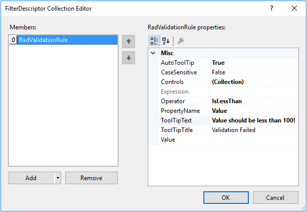 

3. Set the **Value** to *100* and then select **int** from the types drop down:

	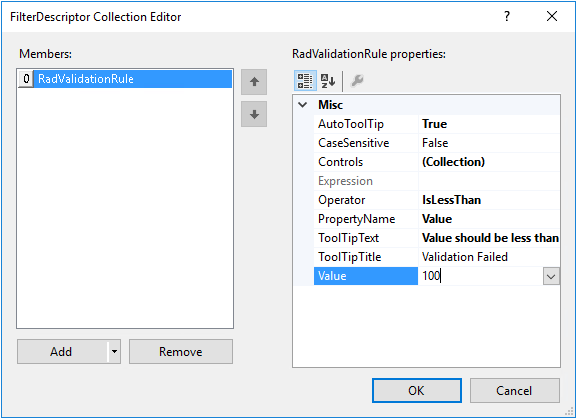 

	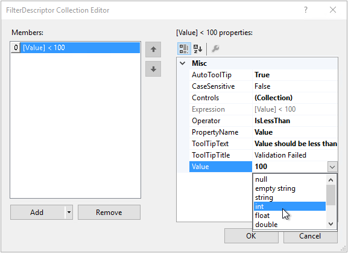 

	>important The data type of the **Value** can be specified after entering a value first and then selecting the type from the drop down. Thus, the correct expression will be serialized.

When you enter a value and try to exit **RadSpinEditor**, the validation rule will be evaluated and an error indication will be shown if the validation fails:

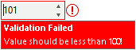 

## RadValidationRuleWithTargetControl

**RadValidationRuleWithTargetControl** allows you to define validation logic of a control against a second control, e.g. if you have two **RadSpinEditor** controls for selecting minimum/maximum price and you need to ensure that minimum price is less than maximum price. 

1. Add a **RadValidationRuleWithTargetControl** and select the "minimum price" **RadSpinEditor** from the **Controls** collection: 

	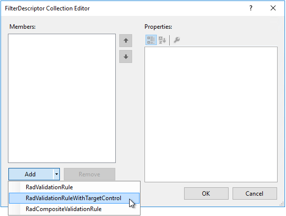 

	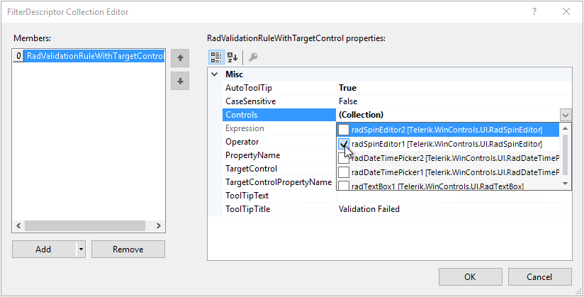 

2. Set the **Operator** to *IsLessThan*, **PropertyName** to *Value*, **ToolTipText** to *"Minimum price should be less than Maximum price!"*:

	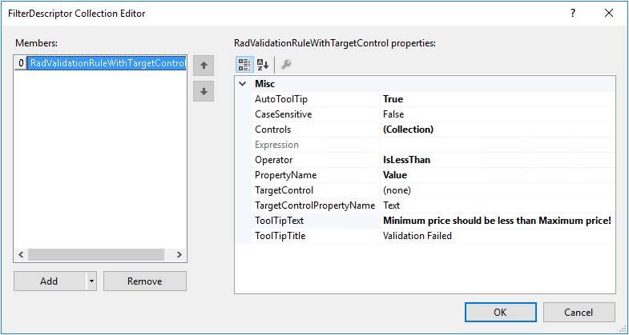 

3. Select the "maximum price" **RadSpinEditor** as **TargetControl** and set the **TargetControlPropertyName** to *Value*:

	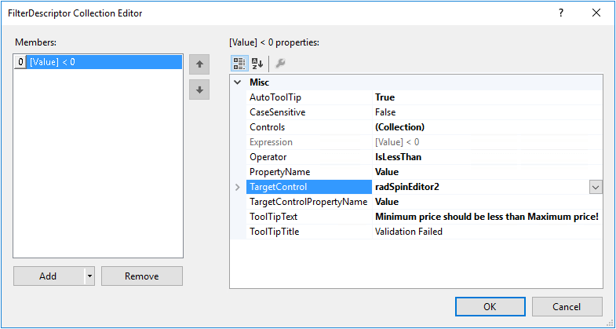 

>important Please ensure that the initial values in both **RadSpinEditor** controls meet the validation. Otherwise, you may remain blocked when you focus the "minimum price" **RadSpinEditor** for the first time, e.g. if both controls have initial value = **0**. No matter what value you enter in the "minimum price" **RadSpinEditor**, you want to be able to validate it and exit the control.
>

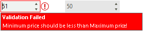   

In a similar way you can add a rule to validate that the "maximum price" **RadSpinEditor**'s value is greater than the value of the first one. Thus, when you focus the second **RadSpinEditor** and try to exit it, it will ensure that a valid value (greater than minimum) is added.

## RadCompositeValidationRule

**RadCompositeValidationRule** allows defining more complex validation logic by adding multiple simpler validation rules.

Considering the previous example with minimum and maximum price, we want to validate "price" **RadSpinEditor**  (radSpinEditor3) which value should be within the [minimum,maximum] range.

1. For this purpose, it is necessary to add a **RadCompositeValidationRule** which contains two **RadValidationRuleWithTargetControls**:

	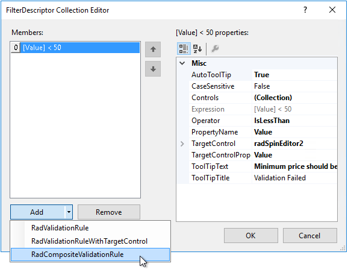   

	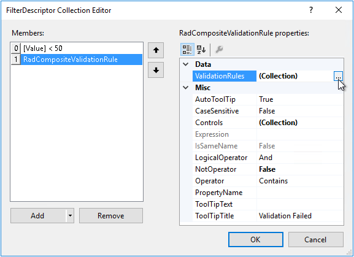 

2. The first **RadValidationRuleWithTargetControl** should validate that "price" **RadSpinEditor** is greater than "minimum price" **RadSpinEditor**:

	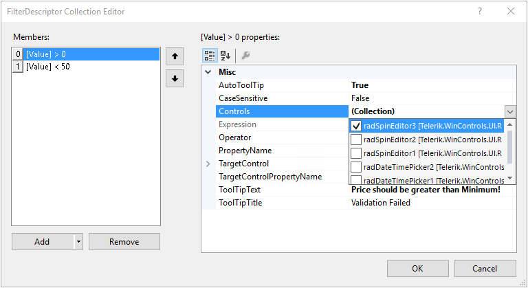   

	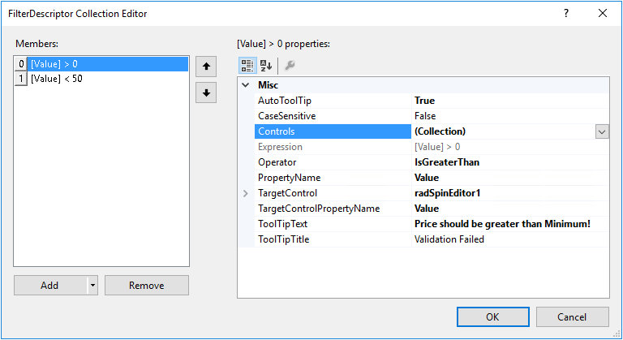 

3. The second **RadValidationRuleWithTargetControl** should validate that "price" **RadSpinEditor** is less than "maximum price" **RadSpinEditor**:

	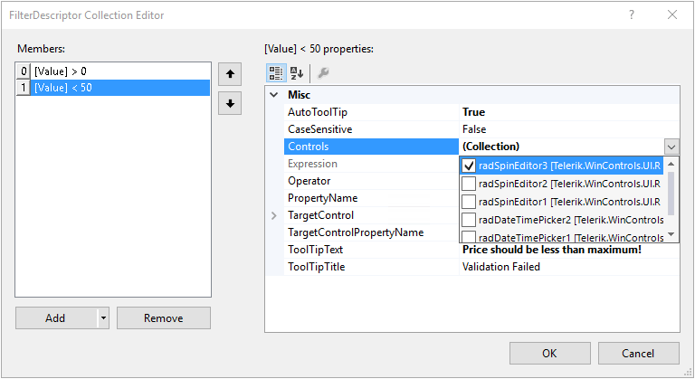   

	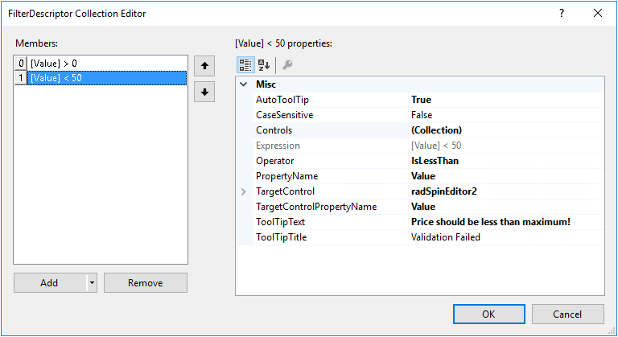 

	>caution None of the associated controls (e.g. radSpinEditor3) of a composite rule should be added as a target in any of the nested rules! Please be careful when defining composite rules in order to get the proper validation logic. Usually, it is even possible to simplify the validation logic and define separate **RadValidationRuleWithTargetControls** outside a composite rule.
	

4. Once you have added the nested rules, return back to the **RadCompositeValidationRule** and specify the **LogicalOperator** and **ToolTipText**:

	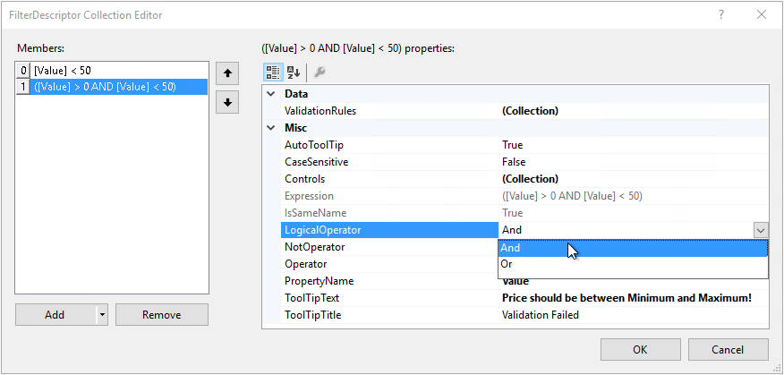  

When you start the application and enter a price that doesn't meet the validations rules, the specified error message for the **composite rule** will be shown:

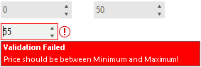  

# See Also

* [Getting Started]()
* [Validation Rules]()
* [Customizing Error Indication]()
        
