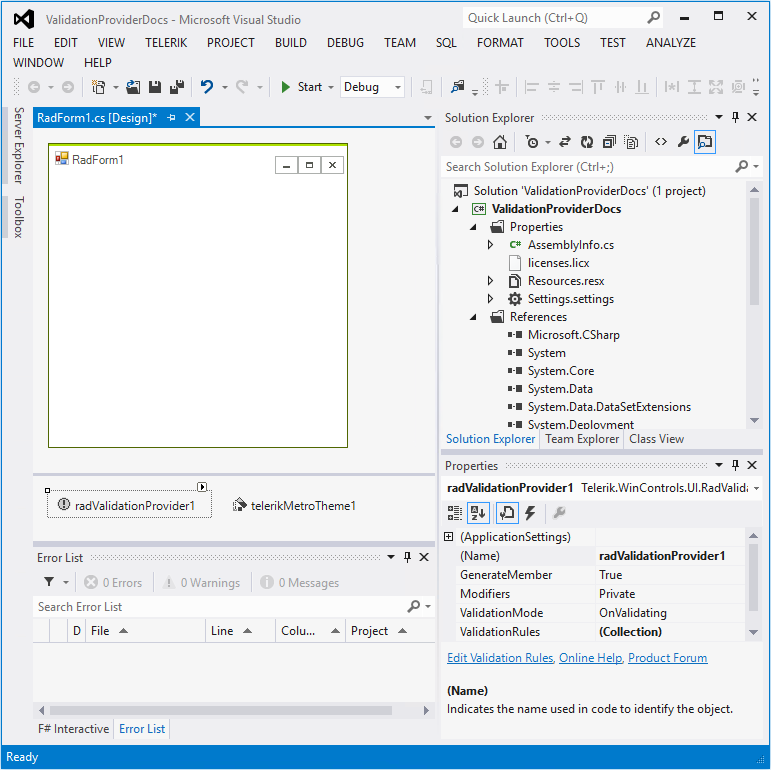
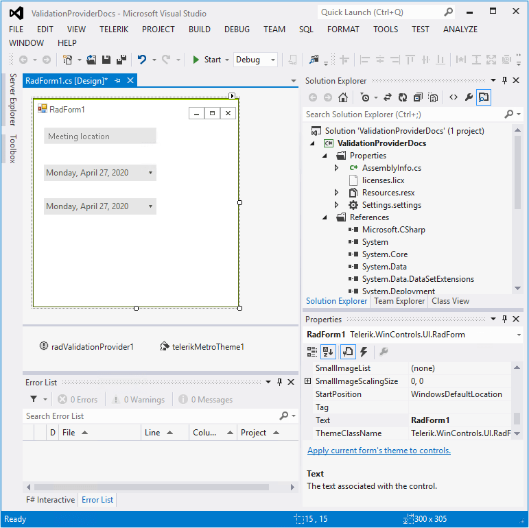
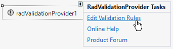
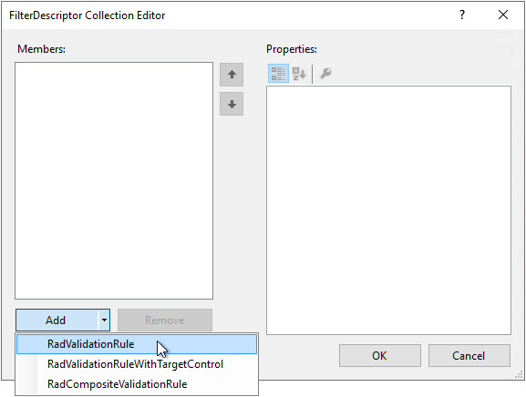
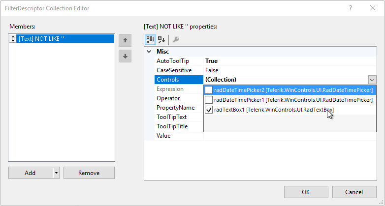
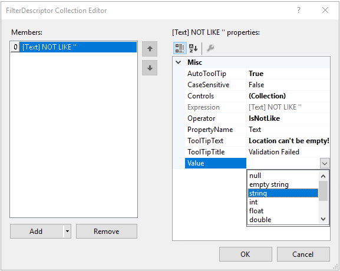
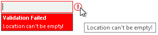
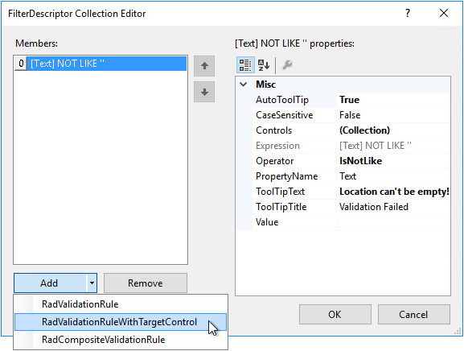
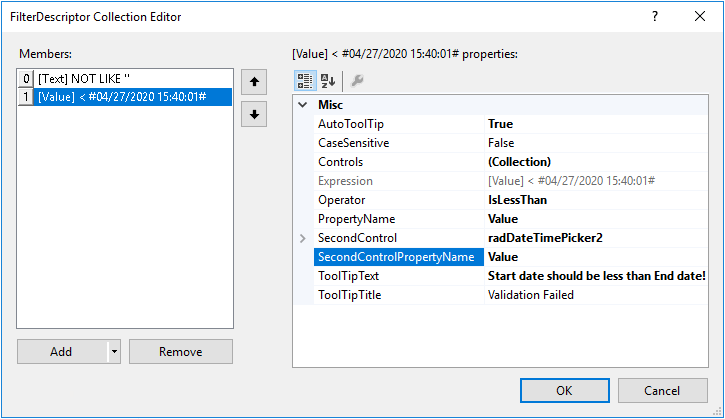
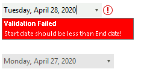

# Getting Started with WinForms ValidationProvider

This article will give you getting started experience with **RadValidationProvider** without using any code.

>note The **TelerikMetro** theme is used for the screenshots in this article.

1. To start using **RadValidationProvider** just drag it from the toolbox and drop it onto the form:

	 

2. Drag one **RadTextBox** and two **RadDateTimePicker** controls from the toolbox. 

	 

3. Open the *FilterDescriptor Collection Editor* by clicking the *Edit Validation Rules* option in the Smart tag. 

	 

4. Add a **RadValidationRule**: 

	 

5. Select **RadTextBox** from the **Controls** drop down list:

	 

6. Select the **Operator** to be *IsNotLike*, leave the **PropertyName** to be *Text* and specify the **ToolTipText**:

	 

	>note The data type of the **Value** can be specified after entering a value first and then selecting the type from the drop down. 

	>note As of **R3 2020** RadValidationProvider supports nested PropertyNames to validate, e.g. **Text.Length**.

7. If you start the application now, focus the **RadTextBox** control, leave it empty and try to navigate to another control, the validation will fail. It would be necessary to enter some text before proceeding further:

	 

8. Add a second validation rule. But this time add a **RadValidationRuleWithTargetControl**:

	 

9. In the **Controls** drop down list, select **radDateTimePicker1**. In the **TargetControl** drop down list, select **radDateTimePicker2**. Set the **Operator** to *IsLessThan*. Specify the **PropertyName** and **TargetControlPropertyName** to *Value* and what **ToolTipText** to be displayed when the validation failed. 

	 

10. This rule will ensure that the first **RadDateTimePicker**'s value is less than the value of the second one:

	 

In a similar way you can add a rule to validate that the second **RadDateTimePicker**'s value is greater than the value of the first one.

# See Also

* [Validation Rules]()
* [Design Time]()
* [Customizing Error Indication]()
 
        
