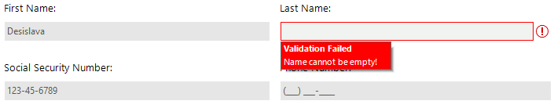

#  Validation Provider

**RadValidationProvider** is a component which provides data validation management for editors in bound and unbound mode. 
It allows users to create various validation rules and associate them with editors derived from the **RadEditorControl** class. With **RadValidationProvider** users are not required to write any code for validation. 





 

## Key Features

The main features are listed below:

* **Validation with Multiple Rules**: there are three types of validation rules (**RadValidationRule**, **RadCompositeValidationRule**, **RadValidationRuleWithSecondControl**). This allows adding complex validation logic containing simpler validations rules.

* **Validate against another control**: perform data validation considering the value of another control, e.g. two **RadDateTimePicker** controls for start/end date selection. You can provide easy data validation ensuring that  the start date is less than the end date. 

* **Validation Modes**: control when the validation will be triggered, e.g. when the text is changed, programmatically, etc.

* **Design Time Experience**: *FilterDescriptor Collection Editor* provides rich design time experience for adding different types of validation rules. 

* **Error Indication**: when the validation fails, an error icon should be displayed next to the control with error text and tool tip under the control. The error icon position can be customized as well. 

# See Also

* [Getting Started]()
* [Validation Rules]()
* [Design Time]()
* [Customizing Error Indication]()
 
        
