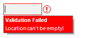
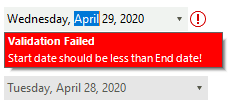
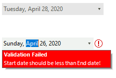
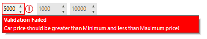

# Validation Rules

**RadValidationProvider** supports three types of validation rules all of which implements the **IRadValidationRule** interface:

* **RadValidationRule**: allows you to define validation logic for a single control considering a validation operator and a value.
* **RadValidationRuleWithTargetControl**: allows you to define validation logic of a control against a second control, e.g. if you have two **RadDateTimePicker** controls for selecting start/end date and you need to ensure that start date is less than end date. 
* **RadCompositeValidationRule**: allows defining more complex validation logic by adding multiple simpler **RadValidationRules**.

>note As of **R3 2020** RadValidationProvider supports nested PropertyNames to validate, e.g. **Text.Length**.

## RadValidationRule

**RadValidationRule** requires the following properties to be set in order to define a validation logic for a single control:

* **AutoToolTip**: a boolean value indicating whether a tool tip will be shown when the validation fails. 
* **Controls**: a collection that contains all controls to which this rule is applied, e.g. you can use one rule for multiple controls.
* **Operator**: specifies the operator to be used for the validation logic. It is of type [FilterOperator](https://docs.telerik.com/devtools/winforms/api/telerik.wincontrols.data.filteroperator.html). Hence, similar to the filter operator, you can use the same validation operators.
* **Value**: specifies the value for the validation comparison. 
* **ToolTipText**: specifies the text to be displayed when the validation fails.
* **ToolTipTitle**: specifies the title of the error tool tip. Its default value is *"Validation Failed"*.

The following code snippet demonstrates how to add a validation rule ensuring that a **RadTextBox** is not empty. When you focus the control and try to exit without entering any text, the validation logic won't succeed and the error tool tip will be displayed: 

 

<snippet id='validation-provider-validationprovidergettingstarted-simplerule-cs' />
<snippet id='validation-provider-validationprovidergettingstarted-simplerule-vb' />

## RadValidationRuleWithTargetControl

**RadValidationRuleWithTargetControl** requires the following properties to be set in order to define a validation logic for a control against a second control:

* **AutoToolTip**: a boolean value indicating whether a tool tip will be shown when the validation fails. 
* **Controls**: a collection that contains all controls to which this rule is applied, e.g. you can use one rule for multiple controls.
* **Operator**: specifies the operator to be used for the validation logic. It is of type [FilterOperator](https://docs.telerik.com/devtools/winforms/api/telerik.wincontrols.data.filteroperator.html). Hence, similar to the filter operator, you can use the same validation operators.
* **PropertyName**: specifies the name of the property which to be used for the validation comparison.
* **TargetControl**: specifies the second control against which the validation logic will be performed.  
* **TargetControlPropertyName**: specifies the name of the second control's property which to be used for the validation comparison.
* **ToolTipText**: specifies the text to be displayed when the validation fails.
* **ToolTipTitle**: specifies the title of the error tool tip. Its default value is *"Validation Failed"*.

The following rule will ensure that the first **RadDateTimePicker**'s value is less than the value of the second one:

 

<snippet id='validation-provider-validationprovidergettingstarted-secondcontrol-cs' />
<snippet id='validation-provider-validationprovidergettingstarted-secondcontrol-vb' />

In order to cover the case that the second **RadDateTimePicker** is greater than the first one, you will need to add one more **RadValidationRuleWithTargetControl**:

 

<snippet id='validation-provider-validationprovidergettingstarted-targetcontrol-cs' />
<snippet id='validation-provider-validationprovidergettingstarted-targetcontrol-vb' />

## RadCompositeValidationRule

**RadCompositeValidationRule** allows you to define a collection of multiple validation rules added to the **ValidationRules** collection. 

The following code snippet demonstrates how to define a **RadCompositeValidationRule** composed of two **RadValidationRuleWithTargetControls** and one **RadValidationRule** ensuring that **Car Price** (radSpinEditor1) is greater than **Minimum Price** (radSpinEditor2) and less than **Maximum Price** (radSpinEditor3). In addition, the price cannot be equal to *5000*:
 
>caution
None of the associated controls (e.g. radSpinEditor1) of a composite rule should be added as a target in any of the nested rules! Please be careful when defining composite rules in order to get the proper validation logic. Usually, it is even possible to simplify the validation logic and define separate **RadValidationRuleWithTargetControls** outside a composite rule.
>

<snippet id='validation-provider-validationprovidergettingstarted-compositerule-cs' />
<snippet id='validation-provider-validationprovidergettingstarted-compositerule-vb' />

 

## ControlValidation Event

When the validation fails, the **ControlValidation** event is fired. The **RadValidationEventArgs** offers the following information:

* **ValidationHelperElement**: stores the styling information of the error indication. 
* **IsValid**: determines whether the controls is validated or not. Even though the validation may fail according to the defined rules, you can determine that the situation is valid in certain cases and set it to *true*.
* **Control**: returns the control being validated. 
* **ErrorImage**: specifies the error image that is being shown when the validation fails.  
* **ErrorSvgImage**: specifies the error vector image that is being shown when the validation fails. 
* **ToolTip**: gives you access to the error tooltip.
* **ToolTipX** and **ToolTipY**: specifies the location of the tooltip. 
* **ToolTipDuration**: specifies the duration how long the tooltip is being shown. 
* **ValidationRule**: returns the rule that fails. 
* **ErrorText**: specifies the error message. 
* **ErrorTitle**: specifies the error title.
* **DisplayIconAndToolTip**: controls whether to display icon and tooltip.
* **EnableToolTipShadow**: controls whether the tooltip's shadow will be rendered.

>note As of R1 2021 RadValidationProvider offers the **ClearErrorStatus** method which allows you to clear the visual indication for the validation error.

The **ControlValidation** event is specifically designed to handle cases in which the validation logic may not be easily defined with validation rules. It gives you the possibility to provide conditional validation and control the situations in which the control being validated has correct content or not.
You can add a **RadValidationRule** for empty Text for example and in addition to this handle the **ControlValidation** event which occurs before a **RadEditorControl** is being validated. The **RadValidationEventArgs** gives very useful information about the tooltip error indication, validation rule, etc. The **IsValid** argument allows you to override the default result indicating whether the validation fails and change the error message accordingly: 

#### Custom Validation in the ControlValidation Event

<snippet id='validation-provider-validationprovidergettingstarted-customvalidation-cs' />
<snippet id='validation-provider-validationprovidergettingstarted-customvalidation-vb' />

# See Also

* [Getting Started]()
* [Design Time]()
* [Customizing Error Indication]()
 
        
