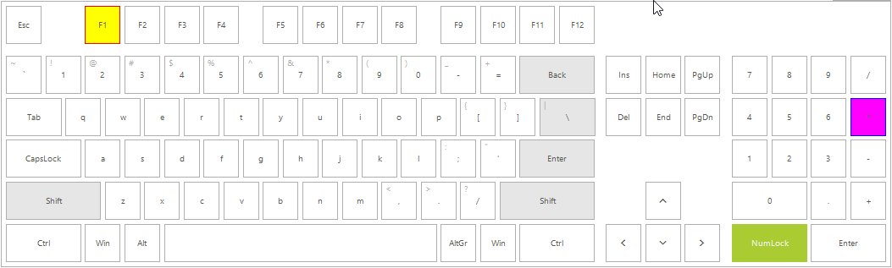

# Accessing and Customizing Elements

**RadVirtualKeyboard** arranges its keys in logical layouts which control the specific position for each key. Before proceeding further, it is recommended to get yourself familiar with the [Structure]() and [Logical Keyboard Layout]() of the virtual keyboard. 

The **VirtualKeyboardLayout** offers a public **Rows** property which is an ObservableCollection of Row instances. Each **Row** represents a logical structure used to organize the keys stored in the **Keys** property. Thus, accessing the keys collection for the respective layout, you can customize a certain Key.

The following code snippet demonstrates how to customize the `F1` button from the functions layout and the `*` key from the numpad layout.

 

 

{{source=..\SamplesCS\VirtualKeyboard\KeyboardGettingStarted.cs region=CustomizeKeys}} 
{{source=..\SamplesVB\VirtualKeyboard\KeyboardGettingStarted.vb region=CustomizeKeys}}

````C#

this.radVirtualKeyboard1.LayoutType = Telerik.WinControls.VirtualKeyboard.KeyboardLayoutType.Extended;
VirtualKeyboardLayout functionsLayout = this.radVirtualKeyboard1.MainLayoutPanel.KeyboardLayouts[0] as VirtualKeyboardLayout;
VirtualKeyboardLayoutPanel mainLayoutPanel = this.radVirtualKeyboard1.MainLayoutPanel.KeyboardLayouts[1] as VirtualKeyboardLayoutPanel;

VirtualKeyboardLayout numpadLayout = mainLayoutPanel.KeyboardLayouts[2] as VirtualKeyboardLayout;
Key key = functionsLayout.Rows[0].Keys[2] as Key;
key.BackColor = Color.Yellow;
key.BorderBoxStyle = BorderBoxStyle.SingleBorder;
key.BorderColor = Color.Red;
key.BorderGradientStyle = GradientStyles.Solid;

key = numpadLayout.Rows[1].Keys[3] as Key;
key.BackColor = Color.Fuchsia;
key.BorderBoxStyle = BorderBoxStyle.SingleBorder;
key.BorderColor = Color.Blue;
key.BorderGradientStyle = GradientStyles.Solid;
     

````
````VB.NET

Me.radVirtualKeyboard1.LayoutType = Telerik.WinControls.VirtualKeyboard.KeyboardLayoutType.Extended
Dim functionsLayout As VirtualKeyboardLayout = TryCast(Me.radVirtualKeyboard1.MainLayoutPanel.KeyboardLayouts(0), VirtualKeyboardLayout)
Dim mainLayoutPanel As VirtualKeyboardLayoutPanel = TryCast(Me.radVirtualKeyboard1.MainLayoutPanel.KeyboardLayouts(1), VirtualKeyboardLayoutPanel)
Dim numpadLayout As VirtualKeyboardLayout = TryCast(mainLayoutPanel.KeyboardLayouts(2), VirtualKeyboardLayout)
Dim key As Key = TryCast(functionsLayout.Rows(0).Keys(2), Key)
key.BackColor = Color.Yellow
key.BorderBoxStyle = BorderBoxStyle.SingleBorder
key.BorderColor = Color.Red
key.BorderGradientStyle = GradientStyles.Solid
key = TryCast(numpadLayout.Rows(1).Keys(3), Key)
key.BackColor = Color.Fuchsia
key.BorderBoxStyle = BorderBoxStyle.SingleBorder
key.BorderColor = Color.Blue
key.BorderGradientStyle = GradientStyles.Solid
   

```` 

{{endregion}}

 


# See Also

* [Structure]()
* [Getting Started]()
 
        
