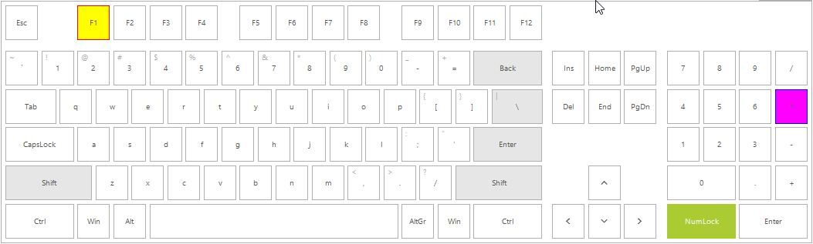

# Accessing and Customizing Elements

**RadVirtualKeyboard** arranges its keys in logical layouts which control the specific position for each key. Before proceeding further, it is recommended to get yourself familiar with the [Structure]() and [Logical Keyboard Layout]() of the virtual keyboard. 

The **VirtualKeyboardLayout** offers a public **Rows** property which is an ObservableCollection of Row instances. Each **Row** represents a logical structure used to organize the keys stored in the **Keys** property. Thus, accessing the keys collection for the respective layout, you can customize a certain Key.

The following code snippet demonstrates how to customize the `F1` button from the functions layout and the `*` key from the numpad layout.

 

 

<snippet id='virtual-keyboard-keyboardgettingstarted-customizekeys-cs' />
<snippet id='virtual-keyboard-keyboardgettingstarted-customizekeys-vb' />

# See Also

* [Structure]()
* [Getting Started]()
 
        
