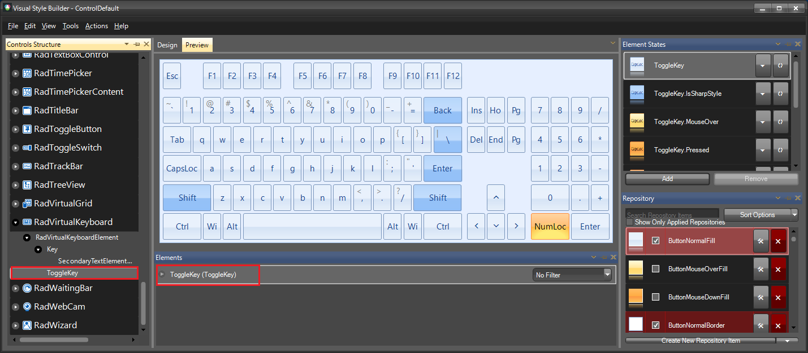
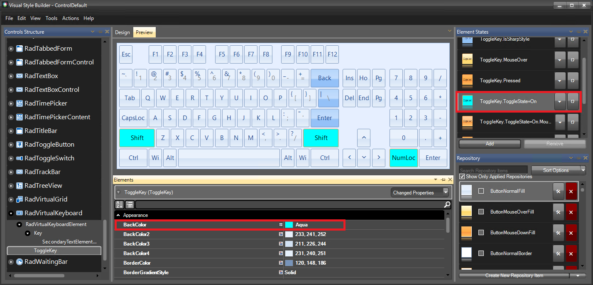

# Themes

This help article will demonstrate a step by step tutorial how to customize the **ControlDefault** theme for **RadVirtualKeyboard** 

1. Open [VisualStyleBuilder](): Start menu (Start >> Programs >> Telerik >> UI for WinForms [version] >> Tools).

1. Export the built-in themes in a specific folder by selecting *File >> Export Built-in Themes*.

1. Load a desired theme from the just exported files by selecting *File >> Open Package*

1. Select **ToggleKey** in *Controls Structure* on the left side. The **ToggleKey** in the *Elements* section is also selected.

	

2. Expand the **ToggleKey** *Element* and modify the applied **BackColor** property and set the **GradientStyle** to *Solid* for the *ToggleState=On* *Element State*. 

	

1. Save the theme by selecting *File >> Save As*.

1. Now, you can apply your custom theme to **RadVirtualKeyboard** by using the demonstrated approach in the following link: [Using custom themes]()

# See Also 

* [Structure]()
* [Accessing and Customizing Elements]()
* [Getting Started with VisualStyleBuilder]()
* [Working With Repository Items]()

 
        
