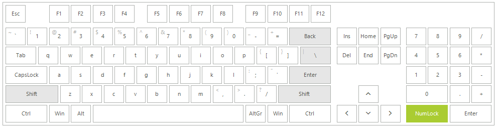
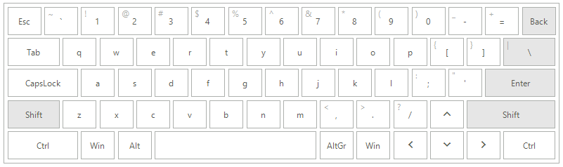
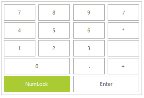
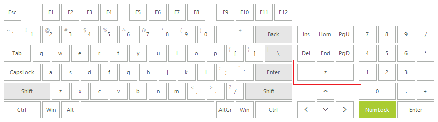

# Default Layouts

The **LayoutType** property of **RadVirtualKeyboard** controls the keyboard layout type. Changing the value will automatically set the **MainLayoutPanel** property with a predefined value.

The available options in the **KeyboardLayoutType** enumeration are:

* **Extended** - A keyboard layout that includes the functions keys, main keys, home buttons and numpad keyboard groups.

	 

* **Simplified** - A keyboard layout that includes the main buttons group with escape key and arrow keys included.

	 

* **Numpad** - A keyboard layout that includes the numpad buttons group.

	 

## Customizing default layouts

**RadVirtualKeyboard** arranges its keys in logical layouts which control the specific position for each key. Before proceeding further, it is recommended to get yourself familiar with the [Structure]() and [Logical Keyboard Layout]() of the virtual keyboard. 

The following code snippet demonstrates how to add a **Z** button in the *Home* layout when using KeyboardLayoutType.*Extended*:

 


#### Adding a key to the default Home layout

{{source=..\SamplesCS\VirtualKeyboard\KeyboardGettingStarted.cs region=AddKeyToHome}} 
{{source=..\SamplesVB\VirtualKeyboard\KeyboardGettingStarted.vb region=AddKeyToHome}}

````C#

this.radVirtualKeyboard1.LayoutType = Telerik.WinControls.VirtualKeyboard.KeyboardLayoutType.Extended;
VirtualKeyboardLayoutPanel mainLayoutPanel = this.radVirtualKeyboard1.MainLayoutPanel.KeyboardLayouts[1] as VirtualKeyboardLayoutPanel;
VirtualKeyboardLayout homeLayout = mainLayoutPanel.KeyboardLayouts[1] as VirtualKeyboardLayout;
int keysRowIndex = 2;
int keyColSpan = 3;
int KeyRowSpan = 1;
homeLayout.Rows[keysRowIndex].Keys.Add(new Key((int)Keys.Z, KeyType.Normal, keyColSpan, KeyRowSpan));
this.radVirtualKeyboard1.MainLayoutPanel.ResetLayout();


````
````VB.NET
Me.radVirtualKeyboard1.LayoutType = Telerik.WinControls.VirtualKeyboard.KeyboardLayoutType.Extended
Dim mainLayoutPanel As VirtualKeyboardLayoutPanel = TryCast(Me.radVirtualKeyboard1.MainLayoutPanel.KeyboardLayouts(1), VirtualKeyboardLayoutPanel)
Dim homeLayout As VirtualKeyboardLayout = TryCast(mainLayoutPanel.KeyboardLayouts(1), VirtualKeyboardLayout)
Dim keysRowIndex As Integer = 2
Dim keyColSpan As Integer = 3
Dim KeyRowSpan As Integer = 1
homeLayout.Rows(keysRowIndex).Keys.Add(New Key(CInt(Windows.Forms.Keys.Z), KeyType.Normal, keyColSpan, KeyRowSpan))
Me.radVirtualKeyboard1.MainLayoutPanel.ResetLayout()


```` 

{{endregion}}

# See Also

* [Structure]()
* [Getting Started]()
 
        
