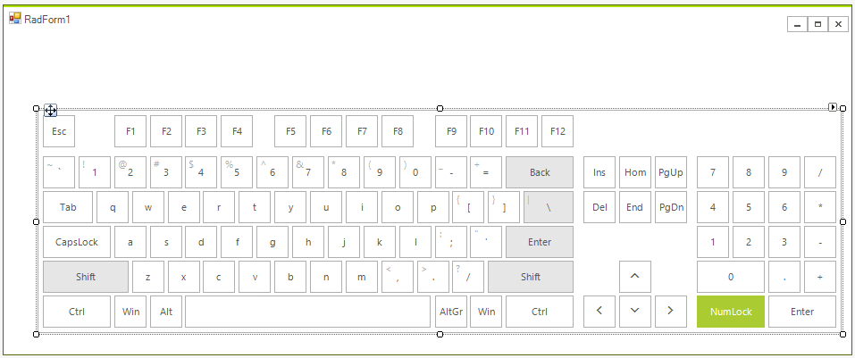
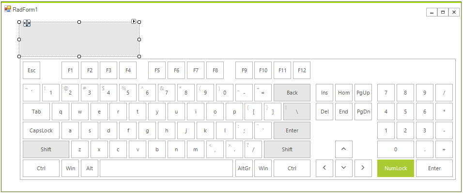
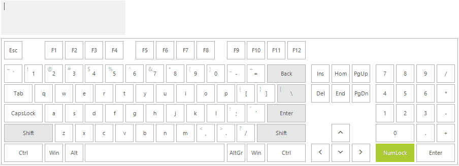

# Getting Started

This article will give you getting started experience with **RadVirtualKeyboard** which is used for the user's input in a **RadTextBox**.

1. To start using **RadVirtualKeyboard** just drag it from the toolbox and drop it onto the form:

	 

2. Drag a **RadTextBox** from the toolbox and drop it onto the form. Then, set its **Multiline** property to *true*. Adjust the **Size** according to your design for the input box:

	 

Now, you are ready to start typing in the input box by using the keyboard:

 

# See Also

* [Structure]()
 
        
