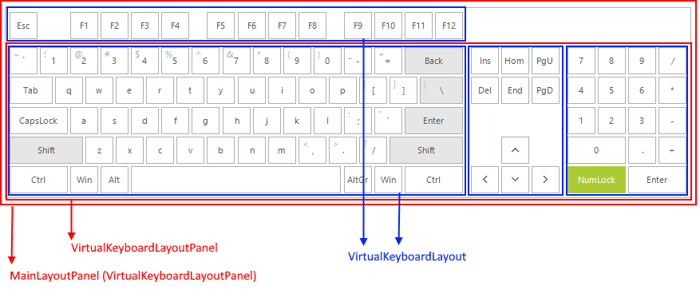
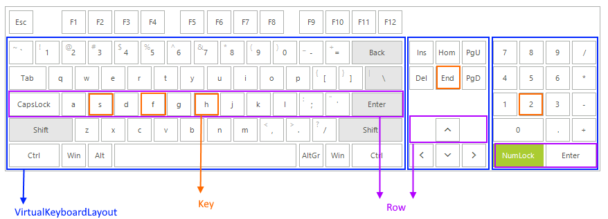

# Logical Keyboard Layout

RadVirtualKeyboard.**MainLayoutPanel** is represented by a **VirtualKeyboardLayoutPanel** that hosts **VirtualKeyboardLayouts** and other **VirtualKeyboardLayoutPanels**. Each **VirtualKeyboardLayout** hosts the keys of the keyboard, the infrastructure to create new keys, organizes them into logical rows and contains the logical layout implementation. Hence, if you need to customize the keys that are displayed on the keyboard, it is necessary to manipulate the respective **VirtualKeyboardLayout**. 

Depending on the applied **LayoutType**, the **MainLayoutPanel** stores in its **KeyboardLayouts** a set of **VirtualKeyboardLayoutPanels** and **VirtualKeyboardLayouts**. The **VirtualKeyboardLayoutPanel** contains a collection of **VirtualKeyboardLayouts** depending on how many group of keys will be created:

 

The **VirtualKeyboardLayout** offers a public **Rows** property which is an **ObservableCollection** of **Row** instances. Each **Row** represents a logical structure used to organize the keys stored in the **Keys** property. 

 
 

#### Accessing the logical layout and iterating the keys in the Home layout

{{source=..\SamplesCS\VirtualKeyboard\KeyboardGettingStarted.cs region=LogicalLayouts}} 
{{source=..\SamplesVB\VirtualKeyboard\KeyboardGettingStarted.vb region=LogicalLayouts}}

````C#

this.radVirtualKeyboard1.LayoutType = Telerik.WinControls.VirtualKeyboard.KeyboardLayoutType.Extended;
VirtualKeyboardLayout functionsLayout = this.radVirtualKeyboard1.MainLayoutPanel.KeyboardLayouts[0] as VirtualKeyboardLayout;
VirtualKeyboardLayoutPanel mainLayoutPanel = this.radVirtualKeyboard1.MainLayoutPanel.KeyboardLayouts[1] as VirtualKeyboardLayoutPanel;
VirtualKeyboardLayout simplifiedLayout = mainLayoutPanel.KeyboardLayouts[0] as VirtualKeyboardLayout;
VirtualKeyboardLayout homeLayout = mainLayoutPanel.KeyboardLayouts[1] as VirtualKeyboardLayout;
VirtualKeyboardLayout numpadLayout = mainLayoutPanel.KeyboardLayouts[2] as VirtualKeyboardLayout;
StringBuilder homeKeys = new StringBuilder();
foreach (Row rows in homeLayout.Rows)
{
    foreach (IKey key in rows.Keys)
    {
        Key k = key as Key;
        if (k != null)
        {
            homeKeys.AppendLine(k.Name);
        } 
    }
}
RadMessageBox.Show(homeKeys.ToString());


````
````VB.NET

Me.radVirtualKeyboard1.LayoutType = Telerik.WinControls.VirtualKeyboard.KeyboardLayoutType.Extended
Dim functionsLayout As VirtualKeyboardLayout = TryCast(Me.radVirtualKeyboard1.MainLayoutPanel.KeyboardLayouts(0), VirtualKeyboardLayout)
Dim mainLayoutPanel As VirtualKeyboardLayoutPanel = TryCast(Me.radVirtualKeyboard1.MainLayoutPanel.KeyboardLayouts(1), VirtualKeyboardLayoutPanel)
Dim simplifiedLayout As VirtualKeyboardLayout = TryCast(mainLayoutPanel.KeyboardLayouts(0), VirtualKeyboardLayout)
Dim homeLayout As VirtualKeyboardLayout = TryCast(mainLayoutPanel.KeyboardLayouts(1), VirtualKeyboardLayout)
Dim numpadLayout As VirtualKeyboardLayout = TryCast(mainLayoutPanel.KeyboardLayouts(2), VirtualKeyboardLayout)
Dim homeKeys As StringBuilder = New StringBuilder()

For Each rows As Row In homeLayout.Rows

    For Each key As IKey In rows.Keys
        Dim k As Key = TryCast(key, Key)

        If k IsNot Nothing Then
            homeKeys.AppendLine(k.Name)
        End If
    Next
Next

Telerik.WinControls.RadMessageBox.Show(homeKeys.ToString())


```` 

{{endregion}}

# See Also

* [Structure]()
* [Getting Started]()
* [Default Layouts]()
 
        
