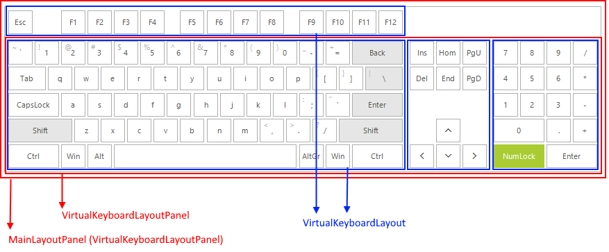
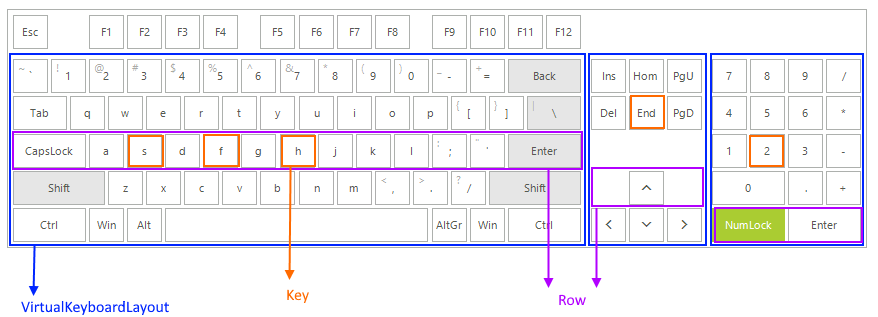

# Logical Keyboard Layout

RadVirtualKeyboard.**MainLayoutPanel** is represented by a **VirtualKeyboardLayoutPanel** that hosts **VirtualKeyboardLayouts** and other **VirtualKeyboardLayoutPanels**. Each **VirtualKeyboardLayout** hosts the keys of the keyboard, the infrastructure to create new keys, organizes them into logical rows and contains the logical layout implementation. Hence, if you need to customize the keys that are displayed on the keyboard, it is necessary to manipulate the respective **VirtualKeyboardLayout**. 

Depending on the applied **LayoutType**, the **MainLayoutPanel** stores in its **KeyboardLayouts** a set of **VirtualKeyboardLayoutPanels** and **VirtualKeyboardLayouts**. The **VirtualKeyboardLayoutPanel** contains a collection of **VirtualKeyboardLayouts** depending on how many group of keys will be created:

 

The **VirtualKeyboardLayout** offers a public **Rows** property which is an **ObservableCollection** of **Row** instances. Each **Row** represents a logical structure used to organize the keys stored in the **Keys** property. 

 
 

#### Accessing the logical layout and iterating the keys in the Home layout

<snippet id='virtual-keyboard-keyboardgettingstarted-logicallayouts-cs' />
<snippet id='virtual-keyboard-keyboardgettingstarted-logicallayouts-vb' />

>note As of **R3 2021 SP1** we introduced new API, the **GetAllRows** and **FindRowByKey** methods, which don't require knowing in which LayoutPanel and the exact row which is the owner of the key, to be able to remove it.

#### API for Adding/Removing keys

<snippet id='virtual-keyboard-keyboardgettingstarted-addremoapi-cs' />
<snippet id='virtual-keyboard-keyboardgettingstarted-addremoapi-vb' />

# See Also

* [Structure]()
* [Getting Started]()
* [Default Layouts]()
 
        
