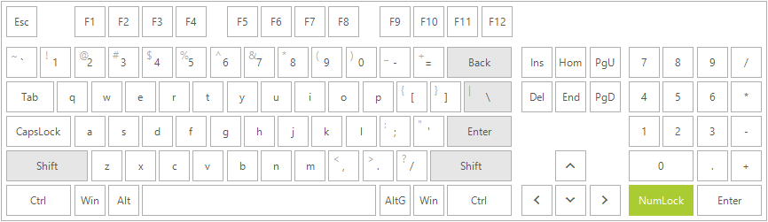

# WinForms VirtualKeyboard Overview

Since **R1 2020** Telerik UI for WinForms suite offers a **RadVirtualKeyboard** control. It is a software component that allows the input of characters without the need for physical keys. The interaction with the virtual keyboard happens mostly via a touchscreen interface, but can also take place in a different form in virtual or augmented reality. 
On a desktop computer, a virtual keyboard might provide an alternative input mechanism for users with disabilities who cannot use a conventional keyboard, or for bi- or multi- lingual users who switch frequently between different character sets or alphabets, which may be confusing over time. Although hardware keyboards are available with dual keyboard layouts (e.g. Cyrillic/Latin letters in various national layouts), the on-screen keyboard provides a handy substitute while working at different stations or on laptops, which seldom come with dual layouts. 





**RadVirtualKeyboard** will serve the need of a virtual keyboard with consistent theming for each WinForms application with Telerik UI for WinForms controls. 

 

## Key Features

* Provides the possibility for text input in a keyboardless environment.

* Predefined layouts.

* Support for defining custom layouts 

* Support for XML files.

* System synchronization: Windows input language change will be monitored. When the keyboard layout is changed, the symbols on the keyboard keys are also updated based on the current Windows input locale. 

 

## Telerik UI for WinForms Learning Resources
* [Telerik UI for WinForms VirtualKeyboard Homepage](https://www.telerik.com/products/winforms/virtual-keyboard.aspx)
* [Get Started with the Telerik UI for WinForms VirtualKeyboard]()
* [Telerik UI for WinForms API Reference](https://docs.telerik.com/devtools/winforms/api/)
* [Getting Started with Telerik UI for WinForms Components]()
* [Telerik UI for WinForms Virtual Classroom (Training Courses for Registered Users)](https://learn.telerik.com/learn/course/external/view/elearning/17/TelerikUIforWinForms) 
* [Telerik UI for WinForms Forum](https://www.telerik.com/forums/winforms)
* [Telerik UI for WinForms Knowledge Base](https://docs.telerik.com/devtools/winforms/knowledge-base)

# See Also

* [Structure]()
* [Getting Started]()
 
        
