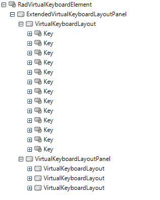
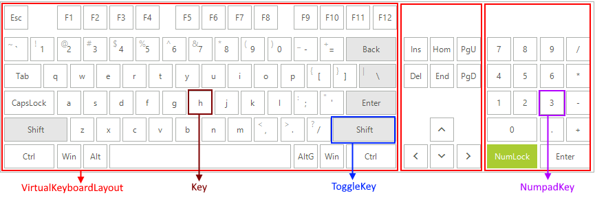

# Structure

This article shows the inner structure and organization of the elements which build the **RadVirtualKeyboard** control.

**RadVirtualKeyboard** has the following elements in its structure:

* **RadVirtualKeyboardElement** – the main element of the keyboard control. It hosts a collection of keyboard layouts.  
* **ExtendedVirtualKeyboardLayoutPanel** - hosts **VirtualKeyboardLayouts** and other **VirtualKeyboardLayoutPanels**. It can have horizontal or vertical orientation and the spacing between layouts can be changed. Note that according to the **LayoutType** the **MainLayoutPanel** might be **ExtendedVirtualKeyboardLayoutPanel**, **SimplifiedVirtualKeyboardLayoutPanel** or **NumpadVirtualKeyboardLayoutPanel**.
* **VirtualKeyboardLayout** - a visual item that hosts the keys of the keyboard, the infrastructure to create new keys, organizes them into logical rows and contains the logical layout implementation. It provides several predefined layouts. 
	* **Key** - represents a single button on a physical keyboard. Letters, numbers, functions, and symbols are all represented on keys.
	* **NumpadKey** - represents a single button from the NumPad group on a physical keyboard.
	* **ToggleKey** - represents a single toggleable button on a physical keyboard. Examples for toggle keys are the shift, caps lock, control buttons.

>note The **ToggleKey** class inherits **LightVisualToggleButtonElement**, the **Key** inherits **LightVisualRepeatButtonElement**. They both implements the **IKey** interface.

>caption Figure 1: RadVirtualKeyboard's elements hierarchy

 

>caption Figure 2: RadVirtualKeyboard's visual structure

 

 

# See Also

* [Getting Started]()
 
        
