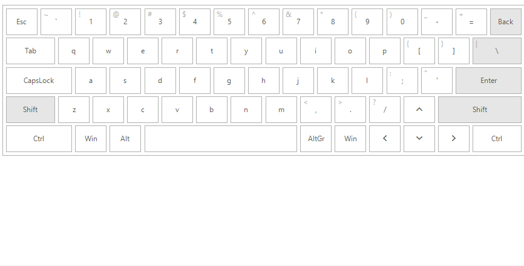

# System Synchronization

**RadVirtualKeyboard** introduces the **SynchronizeCultureWithSystem** property which indicates whether the keyboard will track the system for language changes and will be updated automatically. The default value is *true*. This means that whenever you change the system language, the virtual keyboard will get updated with the relevant keys. 

