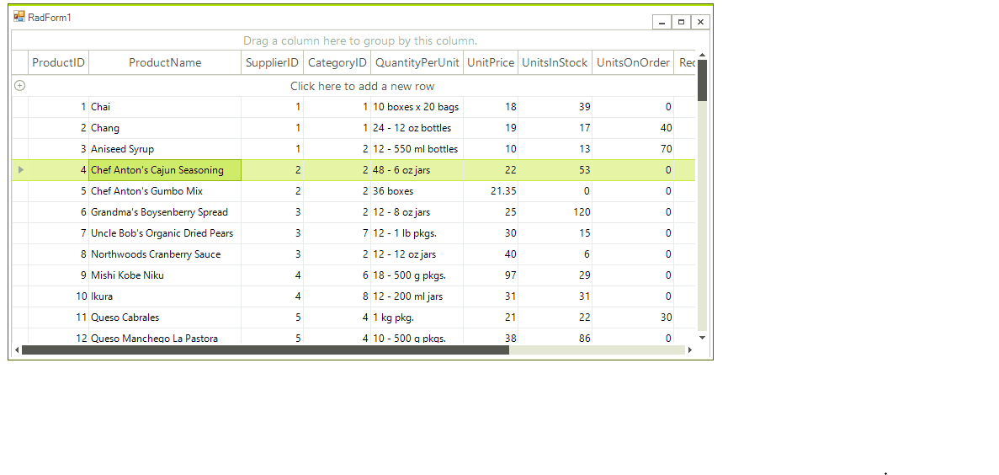

# RadVirtualKeyboardForm

**RadVirtualKeyboardForm** represents a toolbox component that can be used to associate the virtual keyboard to any focusable control or just show a form that allows keyboard input.

The following tutorial will demonstrate how to associate a **RadVirtualKeyboardForm** with a **RadTextBoxEditor** in **RadGridView**.

 

1. Add a **RadGridView** control to the form and populate it with some data.
2. Drag a **RadVirtualKeyboardForm** from the toolbox and drop it onto the form. It will be added as a component: 

	 

3. Subscribe to the RadGridView.**CellEditorInitialized** event and associate the hosted TextBox in the grid editor with the virtual keyboard form:

#### Associated grid editor with RadVirtualKeyboardForm

{{source=..\SamplesCS\VirtualKeyboard\KeyboardGettingStarted.cs region=AssociatedGridEditor}} 
{{source=..\SamplesVB\VirtualKeyboard\KeyboardGettingStarted.vb region=AssociatedGridEditor}}

````C#

        private void radGridView1_CellEditorInitialized(object sender, GridViewCellEventArgs e)
        {
            RadTextBoxEditor editor = e.ActiveEditor as RadTextBoxEditor;
            if (editor != null)
            {
                RadTextBoxEditorElement element = editor.EditorElement as RadTextBoxEditorElement;
                this.radVirtualKeyboardForm1.SetAssociatedKeyboardType(element.TextBoxItem.HostedControl, AssociatedKeyboardType.AssociatedControl);
            }
        }

````
````VB.NET

    Private Sub radGridView1_CellEditorInitialized(ByVal sender As Object, ByVal e As GridViewCellEventArgs)
        Dim editor As RadTextBoxEditor = TryCast(e.ActiveEditor, RadTextBoxEditor)

        If editor IsNot Nothing Then
            Dim element As RadTextBoxEditorElement = TryCast(editor.EditorElement, RadTextBoxEditorElement)
            Me.RadVirtualKeyboardForm1.SetAssociatedKeyboardType(element.TextBoxItem.HostedControl, AssociatedKeyboardType.AssociatedControl)
        End If
    End Sub

```` 

{{endregion}}

 
>note It is possible to associate a **RadTextBox** or any input control with the **RadVirtualKeyboardForm** by setting the **AssociatedKeyboardType** property of the respective input control. In other words, set the RadTextBox.**AssociatedKeyboardType** property to *AssociatedControl*. Thus, the **RadTextBox** control is associated with the virtual keyboard. When the control gets focus, the keyboard will be shown.

# Methods

**RadVirtualKeyboardForm** offers the following methods which can be useful in different scenarios for managing the user's input:

* **GetAssociatedKeyboardType** - Gets the **AssociatedKeyboardType** of a given control.
* **SetAssociatedKeyboardType** - Sets the **AssociatedKeyboardType** to a given control.
* **AddAssociatedControl** - Adds an associated control. When the associated control gains the focus the KeyboardForm will be shown.
* **RemoveAssociatedControl** - Removes an associated control.

The **AssociatedKeyboardType** enumeration defines whether a control is associated to a virtual keyboard. The available values are:
* **None** - The control is not associated with virtual keyboard.
* **AssociatedControl** - The control is associated with the virtual keyboard. When the control gets focus, the keyboard will be shown.

# See Also

* [Structure]()
* [Getting Started]()
 
        
