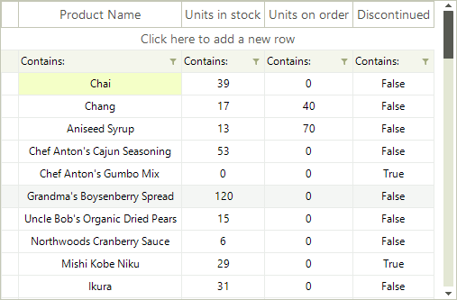
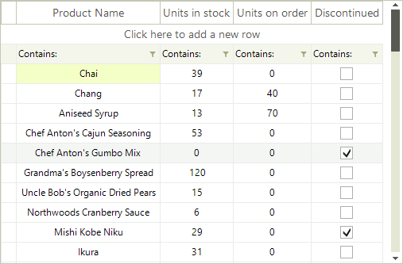

# Custom data cell 

__RadVirtualGrid__ provides a convenient way to create custom cells. __RadVirtualGrid__ supports a powerful and flexible mechanism for creating cell types with custom content elements, functionality and properties.

|Default VirtualGridCellElement for the *Discontinued* column|Custom VirtualGridCheckBoxCellElement for the *Discontinued* column|
|----|----|
|||

You can use the following approach to create a custom data cell with a check box in it:

1\. Create a class for the cell which derives from __VirtualGridCellElement__.

2\. Create the __RadCheckBoxElement__ and add it as a child of the custom cell. You can achieve this by overriding the __CreateChildElements__ method.

3\. Override the __UpdateInfo__ method to update the check box according to the cell value.

4\. The custom cell will have no styles, because there are no defined styles for its type in the themes. You can apply the __VirtualGridCellElement__’s styles to it by defining its __ThemeEffectiveType__.

5\. Thanks to the UI virtualization mechanism of __RadVirtualGrid__, only the currently visible cells are created and they are further reused when needed. A cell element is reused in other rows or columns if it is compatible for them. Override the __IsCompatible__ method and return *true* only for the compatible column and rows. This will prevent the cell from being unintentionally reused by other columns.

6\. In order to center the check box within the cell element, you should override the __ArrangeOverride__ method and arrange the __RadCheckBoxElement__ in the middle.

7\. Subscribe to the RadCheckBoxElement.__ToggleStateChanged__ event in order to synchronize the cell's value with the check box.

#### Custom VirtualGridCellElement

{{source=..\SamplesCS\VirtualGrid\Cells\VirtualGridCustomCells.cs region=CustomCell}} 
{{source=..\SamplesVB\VirtualGrid\Cells\VirtualGridCustomCells.vb region=CustomCell}}


````C#
        
public class MyVirtualGridCheckBoxCellElement : VirtualGridCellElement
{
    private RadCheckBoxElement checkBox;
    
    protected override void CreateChildElements()
    {
        base.CreateChildElements();
        
        this.checkBox = new RadCheckBoxElement();
        this.Children.Add(this.checkBox);
    }
    
    protected override void UpdateInfo(VirtualGridCellValueNeededEventArgs args)
    {
        base.UpdateInfo(args);
        
        if (args.Value is bool)
        {
            this.checkBox.Checked = (bool)args.Value;
        }
    
        this.Text = String.Empty;
    }
    
    public override bool IsCompatible(int data, object context)
    {
        VirtualGridRowElement rowElement = context as VirtualGridRowElement;
    
        return data == 3 && rowElement.RowIndex >= 0;
    }
    
    public override void Attach(int data, object context)
    {
        base.Attach(data, context);
    
        this.checkBox.ToggleStateChanged += checkBox_ToggleStateChanged;
    }
    
    public override void Detach()
    {
        this.checkBox.ToggleStateChanged -= checkBox_ToggleStateChanged;
    
        base.Detach();
    }
    
    protected override SizeF ArrangeOverride(SizeF finalSize)
    {
        SizeF size = base.ArrangeOverride(finalSize);
            
        this.checkBox.Arrange(new RectangleF((finalSize.Width - this.checkBox.DesiredSize.Width) / 2f,
            (finalSize.Height - this.checkBox.DesiredSize.Height) / 2f, this.checkBox.DesiredSize.Width, this.checkBox.DesiredSize.Height));
    
        return size;
    }
    
    protected override Type ThemeEffectiveType
    {
        get
        {
            return typeof(VirtualGridCellElement);
        }
    }
    
    private void checkBox_ToggleStateChanged(object sender, StateChangedEventArgs args)
    {
        this.TableElement.GridElement.SetCellValue(this.checkBox.Checked, this.RowIndex, this.ColumnIndex, this.ViewInfo);
    }
}

````
````VB.NET
Public Class MyVirtualGridCheckBoxCellElement
    Inherits VirtualGridCellElement
    Private checkBox As RadCheckBoxElement
    Protected Overrides Sub CreateChildElements()
        MyBase.CreateChildElements()
        Me.checkBox = New RadCheckBoxElement()
        Me.Children.Add(Me.checkBox)
    End Sub
    Protected Overrides Sub UpdateInfo(args As VirtualGridCellValueNeededEventArgs)
        MyBase.UpdateInfo(args)
        If TypeOf args.Value Is Boolean Then
            Me.checkBox.Checked = CBool(args.Value)
        End If
        Me.Text = [String].Empty
    End Sub
    Public Overrides Function IsCompatible(data As Integer, context As Object) As Boolean
        Dim rowElement As VirtualGridRowElement = TryCast(context, VirtualGridRowElement)
        Return data = 3 AndAlso rowElement.RowIndex = 0
    End Function
    Public Overrides Sub Attach(data As Integer, context As Object)
        MyBase.Attach(data, context)
        AddHandler Me.checkBox.ToggleStateChanged, AddressOf checkBox_ToggleStateChanged
    End Sub
    Public Overrides Sub Detach()
        RemoveHandler Me.checkBox.ToggleStateChanged, AddressOf checkBox_ToggleStateChanged
        MyBase.Detach()
    End Sub
    Protected Overrides Function ArrangeOverride(finalSize As SizeF) As SizeF
        Dim size As SizeF = MyBase.ArrangeOverride(finalSize)
        Me.checkBox.Arrange(New RectangleF((finalSize.Width - Me.checkBox.DesiredSize.Width) / 2.0F, _
                                           (finalSize.Height - Me.checkBox.DesiredSize.Height) / 2.0F, Me.checkBox.DesiredSize.Width, Me.checkBox.DesiredSize.Height))
        Return size
    End Function
    Protected Overrides ReadOnly Property ThemeEffectiveType() As Type
        Get
            Return GetType(VirtualGridCellElement)
        End Get
    End Property
    Private Sub checkBox_ToggleStateChanged(sender As Object, args As StateChangedEventArgs)
        Me.TableElement.GridElement.SetCellValue(Me.checkBox.Checked, Me.RowIndex, Me.ColumnIndex, Me.ViewInfo)
    End Sub
End Class

```` 

{{endregion}}

8\. Subscribe to the __CreateCellElement__ event where we should replace the default __VirtualGridCellElement__ with the custom one:

#### Apply the custom cell

{{source=..\SamplesCS\VirtualGrid\Cells\VirtualGridCustomCells.cs region=ApplyCustomCell}} 
{{source=..\SamplesVB\VirtualGrid\Cells\VirtualGridCustomCells.vb region=ApplyCustomCell}}


````C#
        
private void radVirtualGrid1_CreateCellElement(object sender, VirtualGridCreateCellEventArgs e)
{
    if (e.ColumnIndex == 3 && e.RowIndex >= 0)
    {
        e.CellElement = new MyVirtualGridCheckBoxCellElement();
    }
}

````
````VB.NET
Private Sub radVirtualGrid1_CreateCellElement(sender As Object, e As VirtualGridCreateCellEventArgs)
    If e.ColumnIndex = 3 AndAlso e.RowIndex >= 0 Then
        e.CellElement = New MyVirtualGridCheckBoxCellElement()
    End If
End Sub

```` 

{{endregion}}

9\. Register the custom cell for the specified column index:

{{source=..\SamplesCS\VirtualGrid\Cells\VirtualGridCustomCells.cs region=RegisterCustomColumn}} 
{{source=..\SamplesVB\VirtualGrid\Cells\VirtualGridCustomCells.vb region=RegisterCustomColumn}}


````C#
            
this.radVirtualGrid1.MasterViewInfo.RegisterCustomColumn(3);

````
````VB.NET
Me.RadVirtualGrid1.MasterViewInfo.RegisterCustomColumn(3)

```` 

{{endregion}}

>note Use the __UnregisterCustomColumn__ method if you need to unregister the custom cell for the specified column index. You can detect whether a custom cell is used for a certain column index by using the RadVirtualGrid.MasterViewInfo.__IsCustomColumn__ method.

10\. The last thing we need to do, is to prevent entering edit mode for the custom cell. For this purpose, cancel the __EditorRequired__ event:

#### Prevent entering edit mode

{{source=..\SamplesCS\VirtualGrid\Cells\VirtualGridCustomCells.cs region=CancelEditor}} 
{{source=..\SamplesVB\VirtualGrid\Cells\VirtualGridCustomCells.vb region=CancelEditor}}


````C#
        
private void radVirtualGrid1_EditorRequired(object sender, VirtualGridEditorRequiredEventArgs e)
{
    if (e.ColumnIndex == 3)
    {
        e.Cancel = true;
    }
}

````
````VB.NET
Private Sub radVirtualGrid1_EditorRequired(sender As Object, e As VirtualGridEditorRequiredEventArgs)
    If e.ColumnIndex = 3 Then
        e.Cancel = True
    End If
End Sub

```` 

{{endregion}}


>note The __RadCheckBoxElement__ can be replaced with any other __RadElement__ according to the user's requirement.


# See Also
* [Formatting Data Cells]()

* [Formatting System Cells]()

* [ToolTips]()

