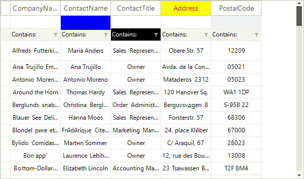

# Formatting System Cells

The __CellFormatting__ event is used to add formatting to grid systems cells: header cells, filter cells and new row cells. Depending on the __RowIndex__, you can distinguish the system cells:

|RowIndex|VirtualGridRowElement|
|----|----|
|-1|VirtualGridHeaderRowElement|
|-2|VirtualGridNewRowElement|
|-3|VirtualGridFilterRowElement|

For example, the code sample below changes the __ForeColor__, __BackColor__ and __GradientStyle__  for the *ContactTitle* header cell, *CompanyName* new row cell and *City* filter cell:



{{source=..\SamplesCS\VirtualGrid\Cells\VirtualGridFormattingCells.cs region=SystemCellsFormatting}} 
{{source=..\SamplesVB\VirtualGrid\Cells\VirtualGridFormattingCells.vb region=SystemCellsFormatting}} 

````C#
        
private void radVirtualGrid_CellFormatting(object sender, VirtualGridCellElementEventArgs e)
{
    if (e.CellElement.RowIndex == -1)  //format header row
    {
        if (e.CellElement.ColumnIndex == 3)
        {
            e.CellElement.DrawFill = true;
            e.CellElement.BackColor = Color.Yellow;
            e.CellElement.GradientStyle = Telerik.WinControls.GradientStyles.Solid;
            e.CellElement.ForeColor = Color.Red;
        }
        else
        {
            e.CellElement.ResetValue(LightVisualElement.DrawFillProperty, ValueResetFlags.Local);
            e.CellElement.ResetValue(LightVisualElement.BackColorProperty, ValueResetFlags.Local);
            e.CellElement.ResetValue(LightVisualElement.GradientStyleProperty, ValueResetFlags.Local);
            e.CellElement.ResetValue(LightVisualElement.ForeColorProperty, ValueResetFlags.Local);
        }
    }
    else if (e.CellElement.RowIndex == -2)//format new row
    {
        if (e.CellElement.ColumnIndex == 1)
        {
            e.CellElement.DrawFill = true;
            e.CellElement.BackColor = Color.Blue;
            e.CellElement.GradientStyle = Telerik.WinControls.GradientStyles.Solid;
            e.CellElement.ForeColor = Color.Aqua;
        }
        else
        {
            e.CellElement.ResetValue(LightVisualElement.DrawFillProperty, ValueResetFlags.Local);
            e.CellElement.ResetValue(LightVisualElement.BackColorProperty, ValueResetFlags.Local);
            e.CellElement.ResetValue(LightVisualElement.GradientStyleProperty, ValueResetFlags.Local);
            e.CellElement.ResetValue(LightVisualElement.ForeColorProperty, ValueResetFlags.Local);
        }
    }
    else if (e.CellElement.RowIndex == -3)//format filter row
    {
        if (e.CellElement.ColumnIndex == 5)
        {
            e.CellElement.DrawFill = true;
            e.CellElement.BackColor = Color.Black;
            e.CellElement.GradientStyle = Telerik.WinControls.GradientStyles.Solid;
            e.CellElement.ForeColor = Color.White;
        }
        else
        {
            e.CellElement.ResetValue(LightVisualElement.DrawFillProperty, ValueResetFlags.Local);
            e.CellElement.ResetValue(LightVisualElement.BackColorProperty, ValueResetFlags.Local);
            e.CellElement.ResetValue(LightVisualElement.GradientStyleProperty, ValueResetFlags.Local);
            e.CellElement.ResetValue(LightVisualElement.ForeColorProperty, ValueResetFlags.Local);
        }
    }
}

````
````VB.NET
Private Sub radVirtualGrid_CellFormatting(sender As Object, e As VirtualGridCellElementEventArgs)
    If e.CellElement.RowIndex = -1 Then
        'format header row
        If e.CellElement.ColumnIndex = 3 Then
            e.CellElement.DrawFill = True
            e.CellElement.BackColor = Color.Yellow
            e.CellElement.GradientStyle = Telerik.WinControls.GradientStyles.Solid
            e.CellElement.ForeColor = Color.Red
        Else
            e.CellElement.ResetValue(LightVisualElement.DrawFillProperty, ValueResetFlags.Local)
            e.CellElement.ResetValue(LightVisualElement.BackColorProperty, ValueResetFlags.Local)
            e.CellElement.ResetValue(LightVisualElement.GradientStyleProperty, ValueResetFlags.Local)
            e.CellElement.ResetValue(LightVisualElement.ForeColorProperty, ValueResetFlags.Local)
        End If
    ElseIf e.CellElement.RowIndex = -2 Then
        'format new row
        If e.CellElement.ColumnIndex = 1 Then
            e.CellElement.DrawFill = True
            e.CellElement.BackColor = Color.Blue
            e.CellElement.GradientStyle = Telerik.WinControls.GradientStyles.Solid
            e.CellElement.ForeColor = Color.Aqua
        Else
            e.CellElement.ResetValue(LightVisualElement.DrawFillProperty, ValueResetFlags.Local)
            e.CellElement.ResetValue(LightVisualElement.BackColorProperty, ValueResetFlags.Local)
            e.CellElement.ResetValue(LightVisualElement.GradientStyleProperty, ValueResetFlags.Local)
            e.CellElement.ResetValue(LightVisualElement.ForeColorProperty, ValueResetFlags.Local)
        End If
    ElseIf e.CellElement.RowIndex = -3 Then
        'format filter row
        If e.CellElement.ColumnIndex = 5 Then
            e.CellElement.DrawFill = True
            e.CellElement.BackColor = Color.Black
            e.CellElement.GradientStyle = Telerik.WinControls.GradientStyles.Solid
            e.CellElement.ForeColor = Color.White
        Else
            e.CellElement.ResetValue(LightVisualElement.DrawFillProperty, ValueResetFlags.Local)
            e.CellElement.ResetValue(LightVisualElement.BackColorProperty, ValueResetFlags.Local)
            e.CellElement.ResetValue(LightVisualElement.GradientStyleProperty, ValueResetFlags.Local)
            e.CellElement.ResetValue(LightVisualElement.ForeColorProperty, ValueResetFlags.Local)
        End If
    End If
End Sub

````

{{endregion}} 

>caution Due to the UI virtualization in __RadVirtualGrid__, cell elements are created only for currently visible cells and are being reused during operations like scrolling, filtering, sorting and so on. In order to prevent applying the formatting to other columns' cell elements (because of the cell reuse) all customization should be reset for the rest of the cell elements.

# See Also
* [Creating custom cells]()

* [Formatting Data Cells]()

* [ToolTips]()

