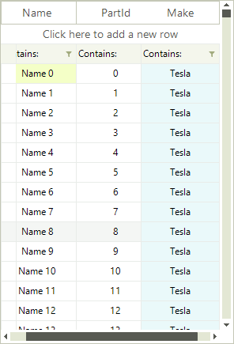

# Pinned Columns

__RadVirtualGrid__ columns can be pinned so that the rows appear anchored to the left or right of the grid. To pin a column you should use the __SetColumnPinPosition__ method where you just need to pass the column index and the desired pin position.

{{source=..\SamplesCS\VirtualGrid\pinned-cells-rows.cs region=PinColumn}} 
{{source=..\SamplesVB\VirtualGrid\pinned-cells-rows.vb region=PinColumn}}
````C#
            
radVirtualGrid1.VirtualGridElement.SetColumnPinPosition(2, PinnedColumnPosition.Right);

````
````VB.NET
radVirtualGrid1.VirtualGridElement.SetColumnPinPosition(2, PinnedColumnPosition.Right)

```` 

{{endregion}}


The result is that the column is pined to the right.



To unpin a row you just need to set its pin position to *none*.

{{source=..\SamplesCS\VirtualGrid\pinned-cells-rows.cs region=UnpinColumn}} 
{{source=..\SamplesVB\VirtualGrid\pinned-cells-rows.vb region=UnpinColumn}}
````C#
        
radVirtualGrid1.VirtualGridElement.SetColumnPinPosition(2, PinnedColumnPosition.None);

````
````VB.NET
radVirtualGrid1.VirtualGridElement.SetColumnPinPosition(2, PinnedColumnPosition.None)

```` 

{{endregion}}


# See Also
* [Resizing Columns Programmatically]()

