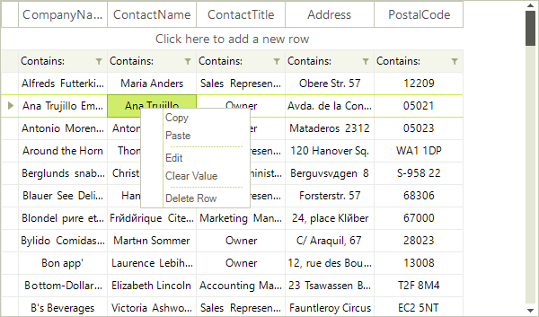
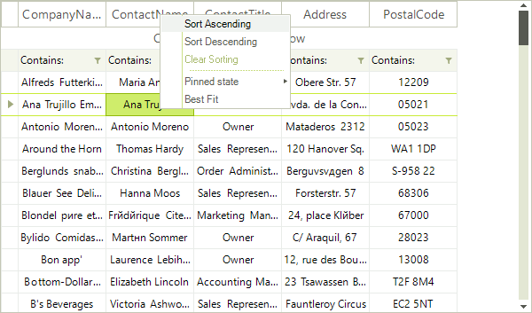
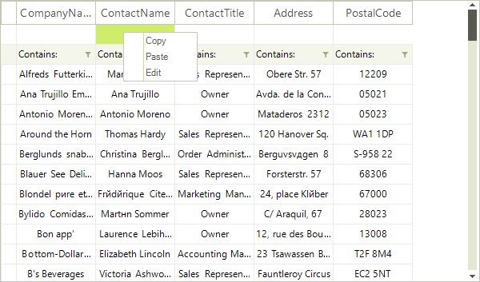

# Context Menu

__RadVirtualGrid__ provides default context menu for its cells. This context menu will appear every time the user right-clicks the __RadVirtualGrid__. Depending on the clicked cell element, a specific context menu is displayed:

>caption Figure 1: Default context menu for data cells
 


>caption Figure 2: Default context menu for header cells



>caption Figure 3: Default context menu for new row



You can control whether the context menu will be displayed by the __AllowColumnHeaderContextMenu__ property for the header cells and the __AllowCellContextMenu__ property for the rest of the cells.

#### Disable context menu for data cells

{{source=..\SamplesCS\VirtualGrid\ContextMenu\VirtualGridContextMenu.cs region=CellContextMenu}} 
{{source=..\SamplesVB\VirtualGrid\ContextMenu\VirtualGridContextMenu.vb region=CellContextMenu}} 

````C#
            
this.radVirtualGrid1.AllowCellContextMenu = false;

````
````VB.NET
Me.RadVirtualGrid1.AllowCellContextMenu = False

````

{{endregion}} 

#### Disable context menu for header cells

{{source=..\SamplesCS\VirtualGrid\ContextMenu\VirtualGridContextMenu.cs region=HeaderContextMenu}} 
{{source=..\SamplesVB\VirtualGrid\ContextMenu\VirtualGridContextMenu.vb region=HeaderContextMenu}} 

````C#
            
this.radVirtualGrid1.AllowColumnHeaderContextMenu = false;

````
````VB.NET
Me.RadVirtualGrid1.AllowColumnHeaderContextMenu = False

````

{{endregion}} 


 

# See Also
* [Custom Context Menu]()

* [Modifying the Default Context Menu]()

