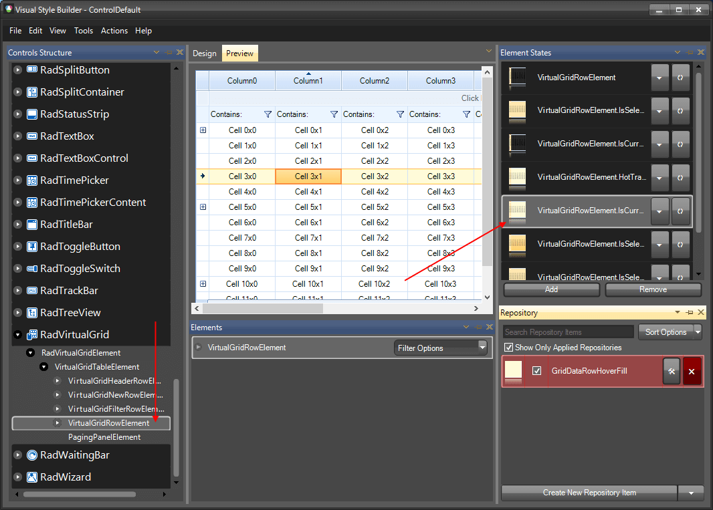
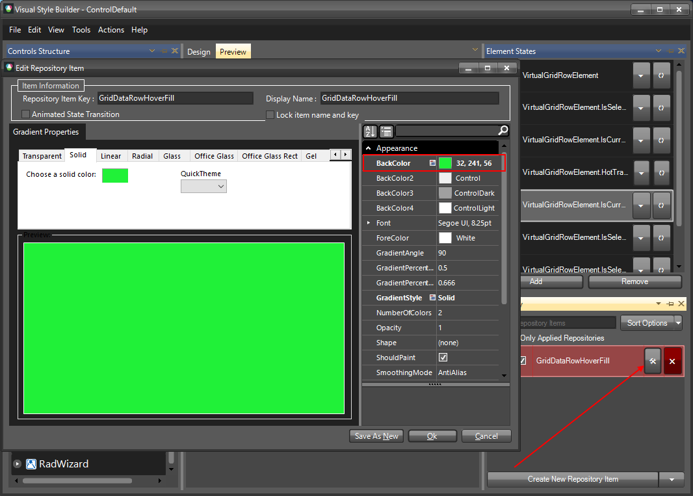
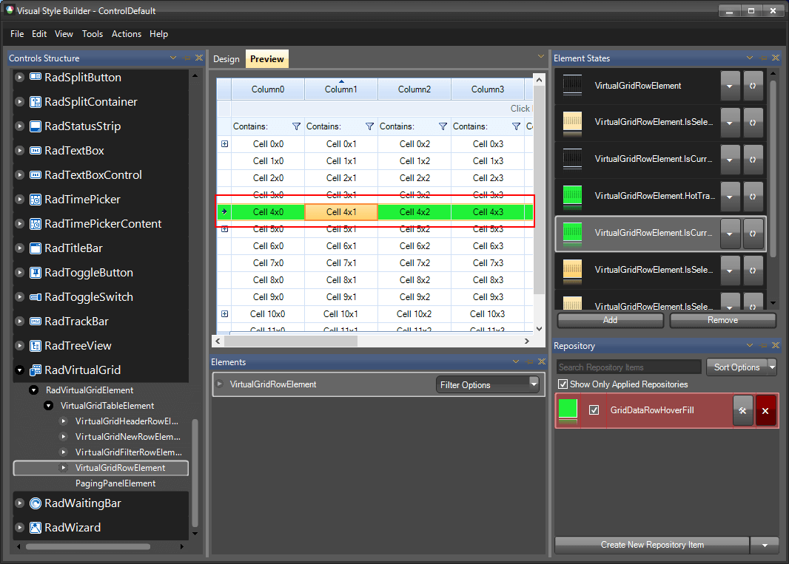

# Themes

This help article will demonstrate a step by step tutorial how to customize the ControlDefault theme for RadVirtualGrid. 

1. Open [VisualStyleBuilder]().

1. [Export the built-in themes] (). in a specific folder by selecting *File >> Export Built-in Themes*.

1. Load a desired theme from the just exported files by selecting *File >> Open Package*

1. Navigate to __RadVirtualGrid__ in `Controls Structure` on the left side. Then, expand to and select __VirtualgridRowElement__. In the `Elements States` window select __VirtualGridRowElement.IsCurrent__.
    

1. Modify the applied fill repository item.
    

1. The following image shows the results. 
    

1. Save the theme by selecting *File >> Save As*.

1. Now, you can apply your custom theme to __RadVirtualGrid__ by using the approach demonstrated in the following link: [Using custom themes]()

# See Also
* [Formatting Data Cells]()

* [Formatting Data Rows]()

* [Formatting System Cells]()

* [Formatting System Rows]()
