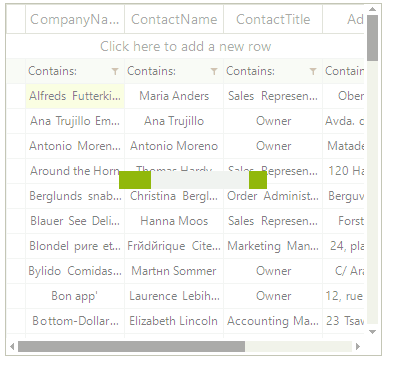
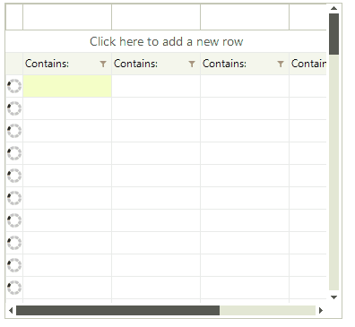

# Busy Indicators

There are two ways to indicate that the grid need time to perform a specific operation. The first one is to show a waiting bar in front of __RadVirtualGrid__. This way the entire control will be unaccessible while the time consuming operation is executed. The second one is to show a waiting icon in the row header. This way you can indicate that a the data for a specific row is still not loaded.

## WatingBar

While this indicator is shown the entire grid is disabled. It is useful when the initial data loading requires more time.

>caption Figure 1: WaitingBar in RadVirtualGrid enabled.

        

The following snippet shows how you can show/hide the waiting bar:

<snippet id='virtualgrid-virtualgridwaitingindicators-waitingbar-cs' />
<snippet id='virtualgrid-virtualgridwaitingindicators-waitingbar-vb' />

## Waiting icon

The waiting icon can be shown in each row header. With it you can indicate that the row data is still not loaded.

>caption Figure 2: Busy indicators in RadVirtualGrid.

The following snippet shows how you can show/hide the waiting icon:

<snippet id='virtualgrid-virtualgridwaitingindicators-icon-cs' />
<snippet id='virtualgrid-virtualgridwaitingindicators-icon-vb' />

# See Also
* [Copy/Paste/Cut]()

* [Scrolling]()

* [Getting Started]()

* [Overview]()

