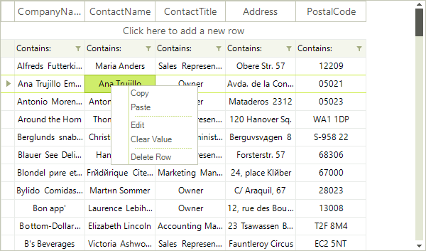
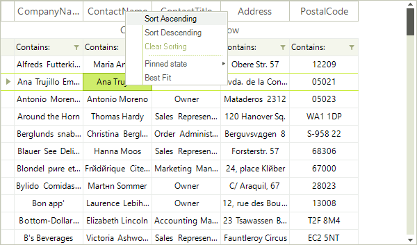
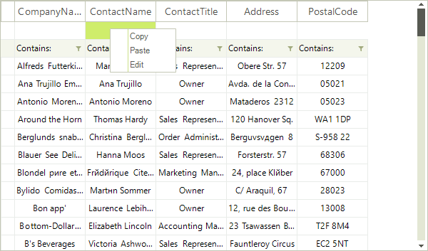

# Context Menu

__RadVirtualGrid__ provides default context menu for its cells. This context menu will appear every time the user right-clicks the __RadVirtualGrid__. Depending on the clicked cell element, a specific context menu is displayed:

>caption Figure 1: Default context menu for data cells
 

>caption Figure 2: Default context menu for header cells

>caption Figure 3: Default context menu for new row

You can control whether the context menu will be displayed by the __AllowColumnHeaderContextMenu__ property for the header cells and the __AllowCellContextMenu__ property for the rest of the cells.

#### Disable context menu for data cells

<snippet id='virtualgrid-virtualgridcontextmenu-cellcontextmenu-cs' />
<snippet id='virtualgrid-virtualgridcontextmenu-cellcontextmenu-vb' />

#### Disable context menu for header cells

<snippet id='virtualgrid-virtualgridcontextmenu-headercontextmenu-cs' />
<snippet id='virtualgrid-virtualgridcontextmenu-headercontextmenu-vb' />

# See Also
* [Custom Context Menu]()

* [Modifying the Default Context Menu]()

