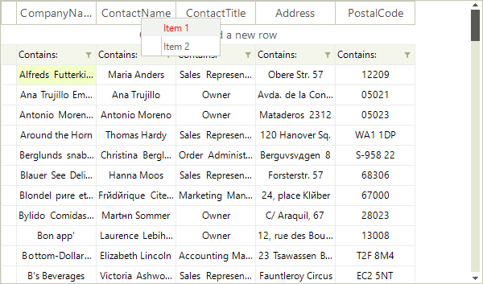
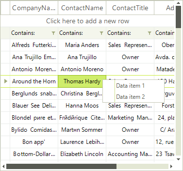
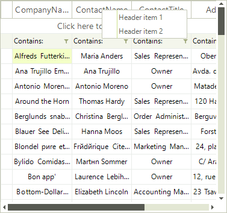

# Custom context Menu

__RadVirtualGrid__ provides a straightforward way to use custom context menus, instead of the default one. This context menu will appear every time the user right-clicks the __RadVirtualGrid__, regardless of the element of the control they click.

 
Start by creating a __RadContextMenu__, initializing its items, and subscribing for the events that you want to handle to achieve the desired behavior:

#### Create a RadContextMenu and initialize its items

<snippet id='virtualgrid-virtualgridcontextmenu-initializecontextmenu-cs' />
<snippet id='virtualgrid-virtualgridcontextmenu-initializecontextmenu-vb' />

Once the menu object has been initialized and populated with menu items, it is ready to be attached to the __RadVirtualGrid__. To do that, subscribe to the __ContextMenuOpening__ event and set the context menu to be displayed:

#### Apply the custom context menu

<snippet id='virtualgrid-virtualgridcontextmenu-applycustomcontextmenu-cs' />
<snippet id='virtualgrid-virtualgridcontextmenu-applycustomcontextmenu-vb' />

# Conditional Custom Context Menus

Applications may need to provide specific individual context menus depending on the element that was clicked. The following example demonstrates how to create two __RadContextMenu__ instances, filled with two items each. Then, according to the right-clicked cell element, apply the relevant menu.

#### Create custom context menus

<snippet id='virtualgrid-virtualgridcontextmenu-conditionalmenus-cs' />
<snippet id='virtualgrid-virtualgridcontextmenu-conditionalmenus-vb' />

#### Apply the relevant menu

<snippet id='virtualgrid-virtualgridcontextmenu-setconditionalmenus-cs' />
<snippet id='virtualgrid-virtualgridcontextmenu-setconditionalmenus-vb' />

|Data Cells Menu|Header Cells Menu|
|----|----|
|||

# See Also
* [Overview]()

* [Modifying the Default Context Menu]()

