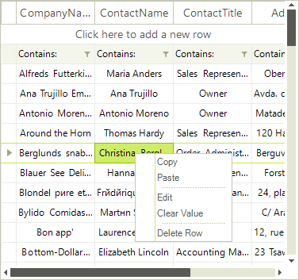
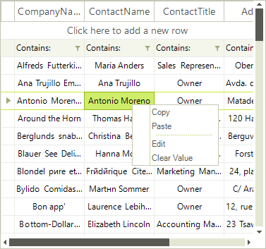
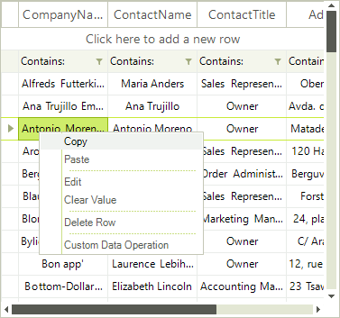

The default __RadVirtualGrid__ context menu can be customized in the __ContextMenuOpening__ event.

# Removing an item from the default RadVirtualGrid context menu:

<snippet id='virtualgrid-virtualgridcontextmenu-removeitem-cs' />
<snippet id='virtualgrid-virtualgridcontextmenu-removeitem-vb' />

|Default Context Menu|Modified Context Menu|
|----|----|
|||

# Adding menu items to the default RadVirtualGrid context menu
 
In order to add custom menu items to the default context menu, you should create menu item instances in the __ContextMenuOpening__ event handler and add them to the __VirtualGridContextMenuOpeningEventArgs.ContextMenu.Items__ collection:

#### Adding items to the default RadVirtualGrid context menu:

<snippet id='virtualgrid-virtualgridcontextmenu-additem-cs' />
<snippet id='virtualgrid-virtualgridcontextmenu-additem-vb' />

|Default Context Menu|Modified Context Menu|
|----|----|
|||

# See Also
* [Overview]()

* [Custom Context Menu]()

