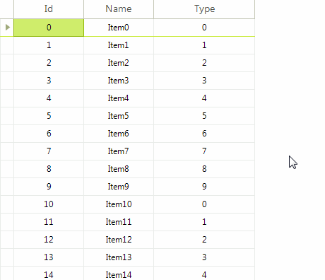

# Using Custom Editors

Most of the grid editors inherit from __BaseVirtualGridEditor__. The following steps and code snippet demonstrate how to replace the standard editor with a custom one containing a __RadMultiColumnComboBoxElement__:

1. Create a class that inherits __BaseVirtualGridEditor__.
2. Override its __CreateEditorElement__ method and return a new instance of __RadMultiColumnComboBoxElement__.
3. Introduce __DataSource__, __ValueMember__, __DisplayMember__ properties of the custom editor in order to data bind the editor element.
4. Override the __Value__ property and manage the editor's value considering the RadMultiColumnComboBoxElement.__SelectedValue__ property.
5. Subscribe to the RadVirtualGrid.__EditorRequired__ event and replace the default editor for the desired column with your custom one.

#### Creating MultiColumnComboBoxVirtualGridEditor 

<snippet id='virtualgrid-virtualgridcustomeditor-myeditor-cs' />
<snippet id='virtualgrid-virtualgridcustomeditor-myeditor-vb' />

## See Also 

[Virtual grid editors]()
