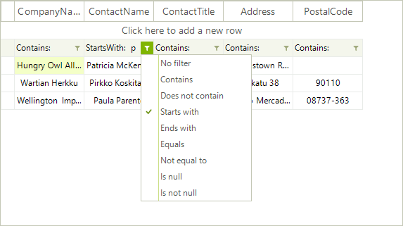
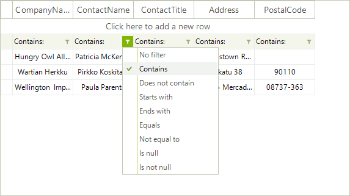
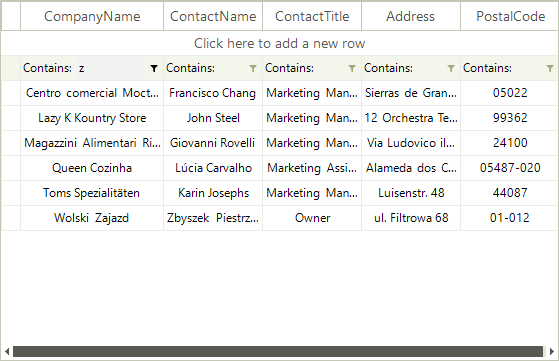

# Filtering Overview

__RadVirtualGrid__ supports data filtering. Set the RadVirtualGrid.__AllowFiltering__ property to *true*.

>caption Figure 1: Filtering is enabled.

#### Enabling the user filtering 

<snippet id='virtualgrid-virtualgridfiltering-allowfiltering-cs' />
<snippet id='virtualgrid-virtualgridfiltering-allowfiltering-vb' />

When filtering is enabled, each column displays a filter button beneath the corresponding header which controls the filter operator:

When clicking over the filter cell, the filter text box is activated:

It is necessary to handle the __FilterChanged__ event which is fired once the __FilterDescriptors__ collection is changed. In the event handler you should extract the filtered data from the external data source.

>note Please refer to the [Populating with data](https://docs.telerik.com/devtools/winforms/controls/virtualgrid/working-with-data/virtualgrid-populating-with-data) help article which demonstrates how to extract the necessary data and fill the virtual grid with data.

The following example demonstrates how to achieve filtering functionality in __RadVirtualGrid__ filled with Northwind.Customers table:

<snippet id='virtualgrid-virtualgridfiltering-filtering-cs' />
<snippet id='virtualgrid-virtualgridfiltering-filtering-vb' />

>note It is necessary to specify the __FieldName__ property for the filter cells.

# See Also
* [Setting Filters Programmatically]()
* [Filter by using a CheckBox in RadVirtualGrid]()

