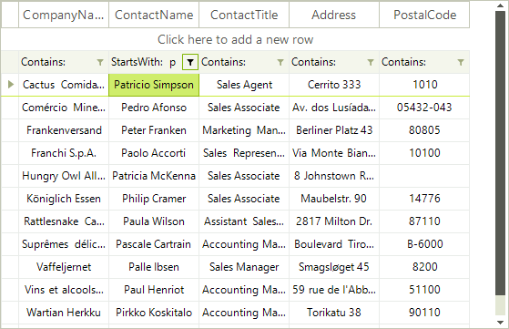
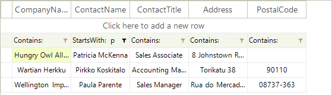

# Setting Filters Programmatically

__RadVirtualGrid__ includes __FilterDescriptors__ property which stores filter descriptors used for filtering operation. The most important classes are:

* __FilterDescriptor:__ Implements filtering property (field) name, filtering operator and value. Used to define simple filtering expressions like Country = "Germany".

* __CompositeFilterDescriptor:__ A collection of multiple filter descriptors with logical operator. Used to define complex filtering expressions like (Country = "Germany" AND (City = "Berlin" OR City = "Aachen")) .

>caution Before proceeding with this article, please refer to the [Filtering Overview]() article which demonstrates how to achieve the filtering functionality in __RadVirtualGrid__.

# Simple descriptors

__FilterDescriptor__'s major properties:

* __PropertyName:__ defines the field, which values will be filtered.

* __Operator:__ allows you to define the type of operator. The possible values are: *Contains*, *Does not contain*, *Starts with*, *Ends with*, *Equals*, *Not equal to*, *Is null*, *Is not null*.

* __Value:__ the value your data will be compared against.

When you add a new descriptor to the collection, the data is automatically filtered according to it.

#### Using simple filter descriptor 

<snippet id='virtualgrid-virtualgridfiltering-simpledescriptors-cs' />
<snippet id='virtualgrid-virtualgridfiltering-simpledescriptors-vb' />

# Composite descriptors

To filter a single data field by multiple values, you have to use the __CompositeFilterDescriptor__ object. It contains a collection of filter descriptors objects and the logical operator for that filters.

#### Using CompositeFilterDescriptor

<snippet id='virtualgrid-virtualgridfiltering-compositedescriptors-cs' />
<snippet id='virtualgrid-virtualgridfiltering-compositedescriptors-vb' />

# See Also
* [Filtering Overview]()

