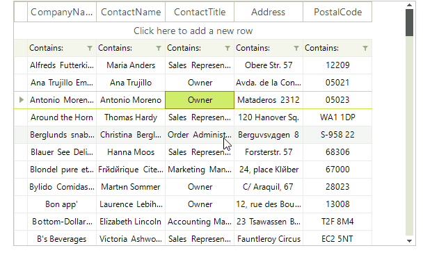

# InputBehavior

__RadVirtualGrid__ manages user mouse and keyboard input over its rows by __VirtualGridInputBehavior__. By implementing a specific custom input behavior, developers can change the default row functionality or supplement the existing one.

You can find below a sample code snippet demonstrating how to override the default up/down navigation logic when pressing the up/down arrow keys and show a message to confirm the operation. For this purpose, we should create a derivative of __VirtualGridInputBehavior__ and override its __HandleUpKey__ and __HandleDownKey__ methods:

#### Custom VirtualGridInputBehavior

<snippet id='virtualgrid-virtualgridinputbehaviorform-custominputbehavior-cs' />
<snippet id='virtualgrid-virtualgridinputbehaviorform-custominputbehavior-vb' />

#### Apply the custom VirtualGridInputBehavior

<snippet id='virtualgrid-virtualgridinputbehaviorform-applyinputbehavior-cs' />
<snippet id='virtualgrid-virtualgridinputbehaviorform-applyinputbehavior-vb' />

>note You can follow a similar approach to customize any of the methods that handle the mouse and keyboard user input.

