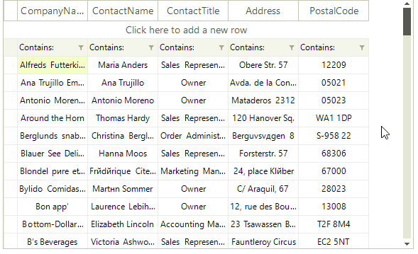
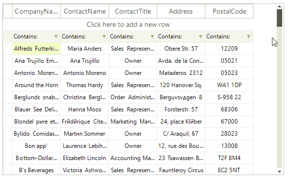
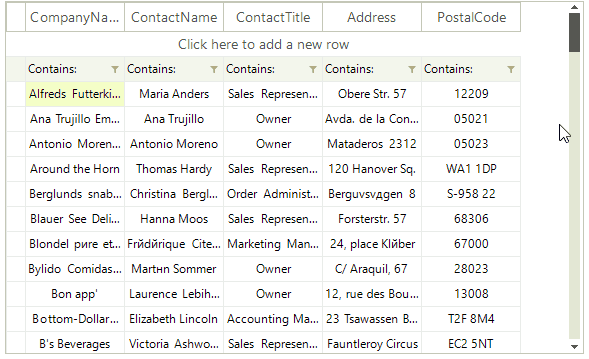

# Scrolling

__RadVirtualGrid__ allows three types of scroll modes:

* __Smooth:__ Sets scrolling by pixel, meaning that an item can be partially visible.

* __Discrete:__ Defines scrolling by only one item at a time.
       
* __Deferred:__ Does not cause GUI updates until the user finishes the scrolling operation.

>caption Figure 1: Smooth Scrolling

<snippet id='virtualgrid-virtualgridresizingrows-smoothscrolling-cs' />
<snippet id='virtualgrid-virtualgridresizingrows-smoothscrolling-vb' />

>caption Figure 2: Discrete Scrolling

<snippet id='virtualgrid-virtualgridresizingrows-discretescrolling-cs' />
<snippet id='virtualgrid-virtualgridresizingrows-discretescrolling-vb' />

>caption Figure 3: Deferred Scrolling

<snippet id='virtualgrid-virtualgridresizingrows-deferredscrolling-cs' />
<snippet id='virtualgrid-virtualgridresizingrows-deferredscrolling-vb' />

The __RadVirtualGrid.UseScrollBarsInHierarchy__ property is responsible for defining whether vertical scrollbars will appear for the inner child views. By default the property is set to *false*.

 

# See Also
* [Busy Indicators]()

* [Copy/Paste/Cut]()

* [Getting Started]()

* [Overview]()

