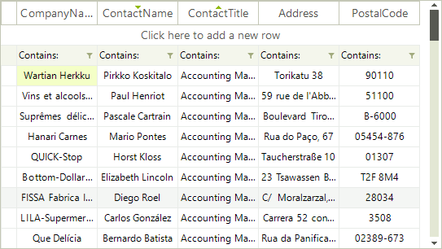

# Setting Sorting Programmatically

__RadVirtualGrid__ includes __SortDescriptors__ property. This collection allows you to use descriptors which define the sorting property and the sorting direction.

>caution Before proceeding with this article, please refer to the [Sorting Overview]() article which demonstrates how to fill data in __RadVirtualGrid__.

Here is how to create and add two __SortDescriptors__. The __PropertyName__ property defines the property, by which the data will be sorted, and the __SortDirection__ property allows you to define the sort direction.

#### Using SortDescriptor 

<snippet id='virtualgrid-virtualgridsorting-runtimesorting-cs' />
<snippet id='virtualgrid-virtualgridsorting-runtimesorting-vb' />

>note The RadVirtualGrid.__AllowMultiColumnSorting__ property should be set to *true* in order to achieve multiple columns sorting. Otherwise, __RadVirtualGrid__ will be sorted by a single column.

# See Also
* [Sorting Overview]()

