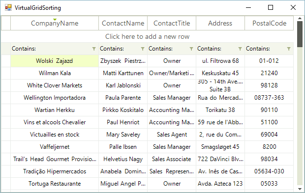
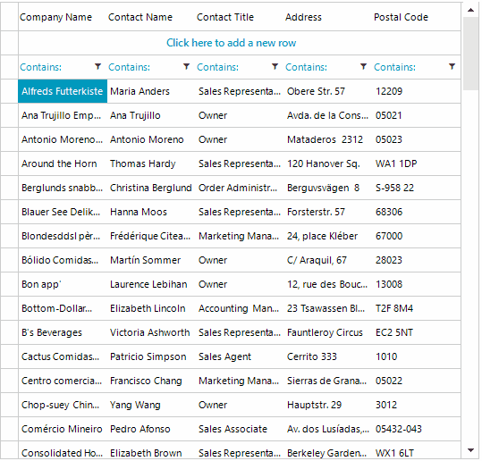

# Sorting Overview

__RadVirtualGrid__  supports data sorting. Set the RadVirtualGrid.__AllowSorting__ property to *true*  in order to enable the user sorting feature. To enable the multiple columns sorting, you should set the RadVirtualGrid.__AllowMultiColumnSorting__ property to *true*: 
 

#### Enabling the user sorting 

<snippet id='virtualgrid-virtualgridsorting-allowsorting-cs' />
<snippet id='virtualgrid-virtualgridsorting-allowsorting-vb' />

#### Disable Natural Sorting

When sorting is enabled, the user can click on the column headers to control the sorting order. RadVirtualGrid supports three orders: __Ascending, Descending, and None (no sort)__. Since R1 2026 columns you can control whether the user will cycle through no sort when clicking on the header cell or whether once sorted the column cannot be "unsorted". This functionality can be enabled by using the __SetColumnAllowNaturalSort()__ method. This method accept two parameters, the first one is the column index and the second one enable/disable the algorithm. Here is how it works:

* __true (default)__: Clicking the header cycles through __None → Ascending → Descending → None__. Users can return to the natural (unsorted) order by clicking three times.
  
* __false__ : Clicking the header cycles through __Ascending → Descending → Ascending__. Users cannot return to unsorted state. Sorting always remains active.

<snippet id='virtualgrid-virtualgridsorting-allownaturalsorting-cs' />
<snippet id='virtualgrid-virtualgridsorting-allownaturalsorting-vb' />

#### Enabling multiple columns sorting

<snippet id='virtualgrid-virtualgridsorting-multicolumnsorting-cs' />
<snippet id='virtualgrid-virtualgridsorting-multicolumnsorting-vb' />

It is necessary to handle the __SortChanged__ event which is fired once the __SortDescriptors__ collection is changed. In the event handler you should extract the sorted data from the external data source.

>note Please refer to the [Populating with data]() help article which demonstrates how to extract the necessary data and fill the virtual grid with data.

The following example demonstrates how to achieve sorting functionality in __RadVirtualGrid__ filled with Northwind.Customers table:

<snippet id='virtualgrid-virtualgridsorting-sorting-cs' />
<snippet id='virtualgrid-virtualgridsorting-sorting-vb' />

## See Also
* [Setting Sorting Programmatically]()

