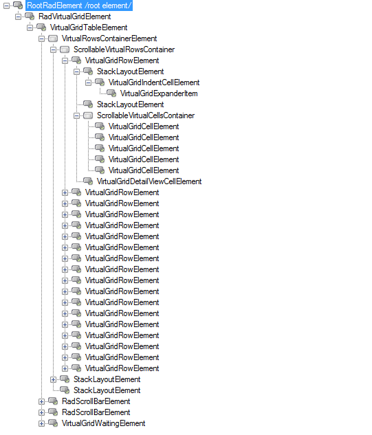

# Element Hierarchy

__RadVirtualGrid__ uses the [Telerik Presentation Framework]()  which enables rich experiences like advanced styling and animations. Just like WPF it uses elements ordered in a visual tree called element hierarchy. This article describes the element hierarchy used in __RadVirtualGrid__:

    

* __VirtualGridElement:__ This is the root element in grid hierarchy. It contains all other grid elements.

* __VirtualGridTableElement:__ The element that contains all visual rows shown in the grid. If the hierarchical grid is used each child view has it own table element. The element can be accessed via the __TableElement__ property and exposes useful row/cell properties.

* __VirtaulGridRowElement:__ This is the base visual element for presenting rows. It contains three different layouts enabling presenting frozen columns.

* __VirtualGridCellElement:__ This is the base visual element for presenting cells. It references __VirtaulGridRowElement__ objects.

* __Scrollbar Elements:__ Instead of using the build-in WinForms mechanism for scrolling, __RadVirtualGrid__ uses elements and implements custom logic. Scrollbar elements are accessible using the __HScrollBar__ and __VScrollBar__ properties of __TableElement__. When using hierarchy, you can choose between a single scrollbar and dedicated scrollbar elements in every child view. To do this, set the __UseScrollbarsInHierarchy__ property to *true*.

# See Also
* [Key Features]()

* [Row Types]()

* [UI Virtualization]()

