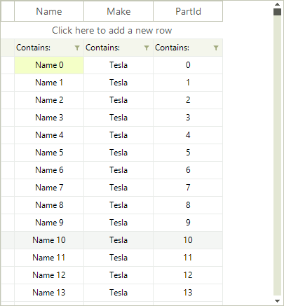

# Getting Started with WinForms VirtualGrid

This tutorial will help you to quickly get started using the control.

## Adding Telerik Assemblies Using NuGet

To use `RadVirtualGrid` when working with NuGet packages, install the `Telerik.UI.for.WinForms.AllControls` package. The [package target framework version may vary]().

Read more about NuGet installation in the [Install using NuGet Packages]() article.

>tip With the 2025 Q1 release, the Telerik UI for WinForms has a new licensing mechanism. You can learn more about it [here]().

## Adding Assembly References Manually

When dragging and dropping a control from the Visual Studio (VS) Toolbox onto the Form Designer, VS automatically adds the necessary assemblies. However, if you're adding the control programmatically, you'll need to manually reference the following assemblies:

* __Telerik.Licensing.Runtime__
* __Telerik.WinControls__
* __Telerik.WinControls.UI__
* __TelerikCommon__

The Telerik UI for WinForms assemblies can be install by using one of the available [installation approaches](). 

## Defining the RadVirtualGrid

The example bellow demonstrates how one can use __RadVirtualGrid__ with a list which contains large amount of data. The example shows how you can use the control events to add or remove rows as well.

>note In order to use __RadVirtualGrid__ you should add reference to the __Telerik.WinControls.GridView__ assembly.
>

### Setting the form and adding data 
 
1\. Add a __RadVirtualGrid__ to a form and set its __Dock__ property to *Fill* .
2\. Add the following sample class to the project.

<snippet id='virtualgrid-virtualgridgettingstarted-sampleclass-cs' />
<snippet id='virtualgrid-virtualgridgettingstarted-sampleclass-vb' />

3\. Now you can create the list of objects which will be used as data source. In addition you can create an array that contains the column names.

<snippet id='virtualgrid-virtualgridgettingstarted-createdata-cs' />
<snippet id='virtualgrid-virtualgridgettingstarted-createdata-vb' />

### Using the virtual grid

1\. To use the grid you should first specify the count of columns and rows. In addition, you should subscribe to the __CellValueNeeded__ and __CellValuePushed__ events which are used for populating the grid with data and updating the data source when values are changed:

<snippet id='virtualgrid-virtualgridgettingstarted-initgrid-cs' />
<snippet id='virtualgrid-virtualgridgettingstarted-initgrid-vb' />

2\. Now you can add the __CellValueNeeded__ event handler. In it we will retrieve the cell value and pass it to the grid according to the current row/column index. The event is fired for the header row so you can set the header cells text as well.

<snippet id='virtualgrid-virtualgridgettingstarted-setvalue-cs' />
<snippet id='virtualgrid-virtualgridgettingstarted-setvalue-vb' />

3\. When a cell value is changed the __CellValuePushed__ event will fire. This will allow you to update the value in the data source:

<snippet id='virtualgrid-virtualgridgettingstarted-updatevalue-cs' />
<snippet id='virtualgrid-virtualgridgettingstarted-updatevalue-vb' />

### Add or remove rows

By default the end user can add or remove rows with the UI. When such operation is performed the __UserAddedRow__ or __UserDeletingRow__ events will fire. 

>note The user can delete multiple rows at once.
>

The following example shows how you can handle the above events and properly update the data source.
<snippet id='virtualgrid-virtualgridgettingstarted-addremove-cs' />
<snippet id='virtualgrid-virtualgridgettingstarted-addremove-vb' />

## See Also
* [Busy Indicators]()

* [Copy/Paste/Cut]()

* [Scrolling]()

* [Overview]()

## Telerik UI for WinForms Learning Resources
* [Telerik UI for WinForms VirtualGrid Component](https://www.telerik.com/products/winforms/virtualgrid.aspx)
* [Getting Started with Telerik UI for WinForms Components](https://docs.telerik.com/devtools/winforms/getting-started/first-steps)
* [Telerik UI for WinForms Setup](https://docs.telerik.com/devtools/winforms/installation-and-upgrades/installing-on-your-computer)
* [Telerik UI for WinForms Application Modernization](https://docs.telerik.com/devtools/winforms/winforms-converter/overview)
* [Telerik UI for WinForms Visual Studio Templates](https://docs.telerik.com/devtools/winforms/visual-studio-integration/visual-studio-templates)
* [Deploy Telerik UI for WinForms Applications](https://docs.telerik.com/devtools/winforms/deployment-and-distribution/application-deployment)
* [Telerik UI for WinForms Virtual Classroom(Training Courses for Registered Users)](https://learn.telerik.com/learn/course/external/view/elearning/17/telerik-ui-for-winforms)
* [Telerik UI for WinForms License Agreement)](https://www.telerik.com/purchase/license-agreement/winforms-dlw-s)

