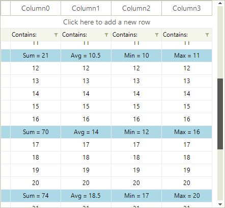

# Summary Rows

The purpose of this article is to demonstrate a sample approach how you can implement a scenario in which __RadVirtualGrid__ displays summary rows.

>caption Figure 1: Summary Rows

We will use a sample DataTable to populate the __RadVirtualGrid__ with data by using the __CellValueNeeded__ event. In a *List* of integer values, we will store the row indices at which the summary rows will be placed. Thus, in the __CellValueNeeded__ event for the specific row index that is related to a summary row, we will calculate the summary value. The __CellFormatting__ event will be used to apply different style for the summary cells. Finally, subscribe to the __CellValuePushed__ event where you should modify the *DataTable* value for the associated cell. In order to update the summary values, call the __RadVirtualGrid.TableElement.SynchronizeRows__ method.

You can find below a complete code snippet which result is illustrated on the above figure:

<snippet id='virtualgrid-virtualgridsummaryrows-summaryrows-cs' />
<snippet id='virtualgrid-virtualgridsummaryrows-summaryrows-vb' />

# See Also

* [Formatting Data Cells]()
* [Populating with Data]()
 
