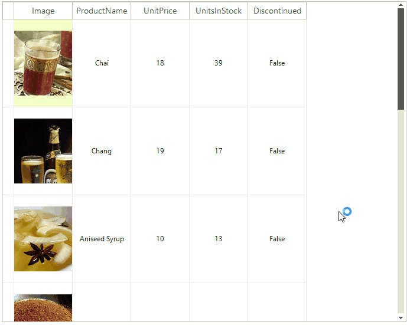

# WinForms VirtualGrid Overview

__RadVirtualGrid__ is a grid component developed on top of Telerik Presentation Framework which provides a convenient way to implement your own data management operations and optimizes the performance when interacting with large amounts of data.





>caption Figure 1: RadVirtualGrid
 

## Key features

* Easily customizable appearance and theming mechanism
* Outstanding performance
* Editing mechanism
* Hierarchical data presentation
* Sorting
* Filtering
* Paging
* Selection and navigation
* Flexible API 

## Telerik UI for WinForms Learning Resources
* [Telerik UI for WinForms VirtualGrid Homepage](https://www.telerik.com/products/winforms/virtualgrid.aspx)
* [Get Started with the Telerik UI for WinForms VirtualGrid]()
* [Telerik UI for WinForms API Reference](https://docs.telerik.com/devtools/winforms/api/)
* [Getting Started with Telerik UI for WinForms Components]()
* [Telerik UI for WinForms Virtual Classroom (Training Courses for Registered Users)](https://learn.telerik.com/learn/course/external/view/elearning/17/TelerikUIforWinForms) 
* [Telerik UI for WinForms Forum](https://www.telerik.com/forums/winforms)
* [Telerik UI for WinForms Knowledge Base](https://docs.telerik.com/devtools/winforms/knowledge-base)

# See Also
* [Busy Indicators]()

* [Copy/Paste/Cut]()

* [Scrolling]()

* [Getting Started]()

