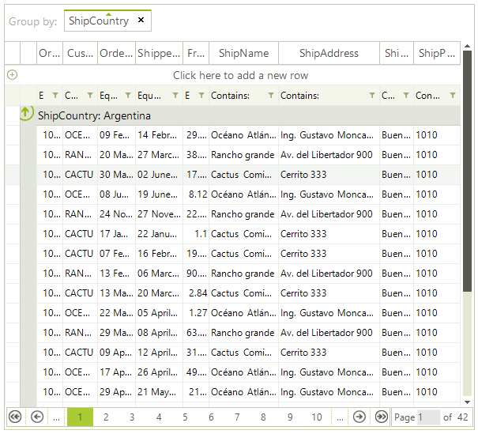

## Paging Overview

The data layer of __RadVirtualGrid__ supports pagination of data natively. Enabling the paging does not change the way the virtual grid works. There is a number of features, which will allow you to easily configure and manage the paging of the data.

To access the public API for paging you will use the __MasterViewInfo__ of __RadVirtualGrid__. Here are the more important properties and methods:

* __EnablePaging:__ Gets or sets a value indicating whether paging is enabled.

* __PageSize:__ Gets or sets the number of items shown per page.

* __TotalPages:__ Gets the total number of pages.

* __PageIndex:__ Gets the zero-based index of the current page.

* __MoveToFirstPage:__ Sets RadGridView to its first page.

* __MoveToPreviousPage:__ Sets RadGridView to the previous page.

* __MoveToPage (int pageIndex):__ Sets RadGridView to a specific page.

* __MoveToNextPage:__ Sets RadGridView to the next page.

* __MoveToLastPage:__ Sets RadGridView to its last page.

# See Also
* [Paging Panel]()

