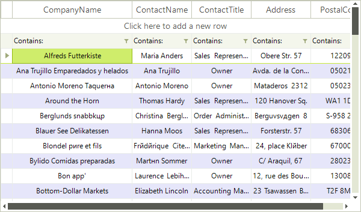

# Alternating Row Color

__RadVirtualGrid__ supports an alternating row color. It can be enabled by simply setting the __EnableAlternatingRowColor__ to *true*.

>caption Fig.1 Alternating Row color


{{source=..\SamplesCS\VirtualGrid\Rows\VirtualGridRowsAlternatingRownColor.cs region=Settings}} 
{{source=..\SamplesVB\VirtualGrid\Rows\VirtualGridRowsAlternatingRownColor.vb region=Settings}} 

````C#
this.radVirtualGrid1.EnableAlternatingRowColor = true;
this.radVirtualGrid1.TableElement.AlternatingRowColor = Color.LightBlue;

````
````VB.NET
Me.RadVirtualGrid1.EnableAlternatingRowColor = True
Me.RadVirtualGrid1.TableElement.AlternatingRowColor = Color.LightBlue

````

{{endregion}}

# See Also
* [Formatting Data Rows]()

* [Formatting System Rows]()

* [Pinned Rows]()

* [Resizing Rows Programmatically]()

* [System Rows]()

