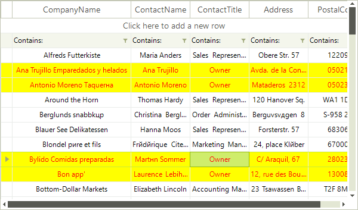

# Formatting Data Rows

Use the __RowFormatting__ event to apply custom formatting to RadVirtualGrid's data rows. The code snippet below demonstrates changing the __ForeColor__, __BackColor__ and __GradientStyle__ in all data rows where the cell value in the *ContactTitle* column is *Owner*:



{{source=..\SamplesCS\VirtualGrid\Rows\VirtualGridFormattingRows.cs region=FormattingRows}} 
{{source=..\SamplesVB\VirtualGrid\Rows\VirtualGridFormattingRows.vb region=FormattingRows}} 

````C#
        
private void radVirtualGrid1_RowFormatting(object sender, VirtualGridRowElementEventArgs e)
{ 
    VirtualGridCellElement contactTitleCell = radVirtualGrid1.VirtualGridElement.GetCellElement(e.RowElement.RowIndex, 3, radVirtualGrid1.MasterViewInfo);
    if (contactTitleCell != null && contactTitleCell.Value != null && contactTitleCell.Value.ToString() == "Owner")
    {
        e.RowElement.DrawFill = true;
        e.RowElement.BackColor = Color.Yellow;
        e.RowElement.GradientStyle = Telerik.WinControls.GradientStyles.Solid;
        e.RowElement.ForeColor = Color.Red;
    }
    else
    {
        e.RowElement.ResetValue(LightVisualElement.DrawFillProperty, ValueResetFlags.Local);
        e.RowElement.ResetValue(LightVisualElement.BackColorProperty, ValueResetFlags.Local);
        e.RowElement.ResetValue(LightVisualElement.GradientStyleProperty, ValueResetFlags.Local);
        e.RowElement.ResetValue(LightVisualElement.ForeColorProperty, ValueResetFlags.Local);
    }
}

````
````VB.NET
Private Sub radVirtualGrid1_RowFormatting(sender As Object, e As VirtualGridRowElementEventArgs)
    Dim contactTitleCell As VirtualGridCellElement = RadVirtualGrid1.VirtualGridElement.GetCellElement(e.RowElement.RowIndex, 3, RadVirtualGrid1.MasterViewInfo)
    If contactTitleCell IsNot Nothing AndAlso contactTitleCell.Value IsNot Nothing AndAlso contactTitleCell.Value.ToString() = "Owner" Then
        e.RowElement.DrawFill = True
        e.RowElement.BackColor = Color.Yellow
        e.RowElement.GradientStyle = Telerik.WinControls.GradientStyles.Solid
        e.RowElement.ForeColor = Color.Red
    Else
        e.RowElement.ResetValue(LightVisualElement.DrawFillProperty, ValueResetFlags.Local)
        e.RowElement.ResetValue(LightVisualElement.BackColorProperty, ValueResetFlags.Local)
        e.RowElement.ResetValue(LightVisualElement.GradientStyleProperty, ValueResetFlags.Local)
        e.RowElement.ResetValue(LightVisualElement.ForeColorProperty, ValueResetFlags.Local)
    End If
End Sub

````

{{endregion}} 

>caution Due to the UI virtualization in __RadVirtualGrid__, row elements are created only for currently visible rows and are being reused during operations like scrolling, filtering, sorting and so on. In order to prevent applying the formatting to other columns' row elements (because of the row reuse) all customization should be reset for the rest of the row elements.

# See Also
* [Alternating Row Color]()

* [Formatting System Rows]()

* [Pinned Rows]()

* [Resizing Rows Programmatically]()

* [System Rows]()

