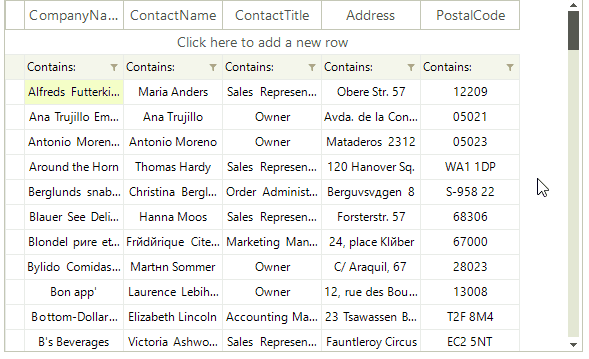
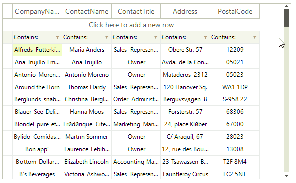

# Scrolling

__RadVirtualGrid__ allows three types of scroll modes:

* __Smooth:__ Sets scrolling by pixel, meaning that an item can be partially visible.

* __Discrete:__ Defines scrolling by only one item at a time.
       
* __Deferred:__ Does not cause GUI updates until the user finishes the scrolling operation.

>caption Figure 1: Smooth Scrolling




{{source=..\SamplesCS\VirtualGrid\Rows\VirtualGridResizingRows.cs region=SmoothScrolling}} 
{{source=..\SamplesVB\VirtualGrid\Rows\VirtualGridResizingRows.vb region=SmoothScrolling}}
````C#
this.radVirtualGrid1.TableElement.RowScroller.ScrollMode = ItemScrollerScrollModes.Smooth;

````
````VB.NET
Me.RadVirtualGrid1.TableElement.RowScroller.ScrollMode = ItemScrollerScrollModes.Smooth

````


{{endregion}}

>caption Figure 2: Discrete Scrolling



{{source=..\SamplesCS\VirtualGrid\Rows\VirtualGridResizingRows.cs region=DiscreteScrolling}} 
{{source=..\SamplesVB\VirtualGrid\Rows\VirtualGridResizingRows.vb region=DiscreteScrolling}}
````C#
this.radVirtualGrid1.TableElement.RowScroller.ScrollMode = ItemScrollerScrollModes.Discrete;

````
````VB.NET
Me.RadVirtualGrid1.TableElement.RowScroller.ScrollMode = ItemScrollerScrollModes.Discrete

````


{{endregion}}

>caption Figure 3: Deferred Scrolling


{{source=..\SamplesCS\VirtualGrid\Rows\VirtualGridResizingRows.cs region=DeferredScrolling}} 
{{source=..\SamplesVB\VirtualGrid\Rows\VirtualGridResizingRows.vb region=DeferredScrolling}}
````C#
this.radVirtualGrid1.TableElement.RowScroller.ScrollMode = ItemScrollerScrollModes.Deferred;

````
````VB.NET
Me.RadVirtualGrid1.TableElement.RowScroller.ScrollMode = ItemScrollerScrollModes.Deferred

````


{{endregion}}


The __RadVirtualGrid.UseScrollBarsInHierarchy__ property is responsible for defining whether vertical scrollbars will appear for the inner child views. By default the property is set to *false*.

 

# See Also
* [Busy Indicators]()

* [Copy/Paste/Cut]()

* [Getting Started]()

* [Overview]()

