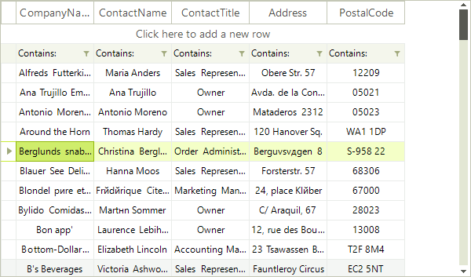
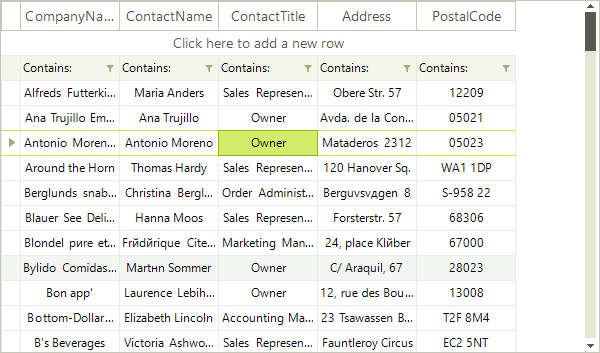

# Basic Selection

RadVirtualGrid provides you with a selection functionality, which allows the user to select one or more items (rows or cells) from the data displayed by the control.

## Row Selection 

To select an item in __RadVirtualGrid__ click in the rectangle area of the desired row. By default the user can select only one row (the entire row is selected). 




## Cell Selection
You can modify __RadVirtualGrid__ to select single cell instead of entire row by setting its __SelectionMode__ property to __CellSelect__:

{{source=..\SamplesCS\VirtualGrid\VirtualGridSelection.cs region=cellSelect}} 
{{source=..\SamplesVB\VirtualGrid\VirtualGridSelection.vb region=cellSelect}}
````C#
            
this.radVirtualGrid1.SelectionMode = VirtualGridSelectionMode.CellSelect;

````
````VB.NET
Me.radVirtualGrid1.SelectionMode = VirtualGridSelectionMode.CellSelect

```` 

{{endregion}}

After setting this property, to select a cell in __RadVirtualGrid__, click the desired cell.



## Events

The following events will fire in case the selection is changed:
* __SelectionChanging:__ fires before the selection is changed.
* __SelectionChanged:__ fires after the selection is changed.
* __CurrentCellChanging:__ fires before the current cell is changed.
* __CurrentCellChanged:__ fires after the current cell is changed.

## API

Using the __Selection__ property of the __VirtualGridElement__ you can perform various selection operations. Here are the most common methods which this property exposes:
* __ClearSelection:__ clears all selected items.
* __IsSelected:__ you can use the this method to check if particular cell is selected.
* __RowContainsSelection:__ use this method to check if a particular row contains the selected cell.
* __SelectAll:__ use this method to select all cells.

In addition, you can use the following properties to get the selected rows or cells:

* __CurrentRowIndex:__ gets the current row index.

* __CurrentColumnIndex:__ gets the current selected column index.

* __SelectedRegion:__ returns the first selected region.

* __SelectedRegions:__ returns all selected regions.

# See Also
* [Multiple Selection]()

* [Selecting Cells Programmatically]()

