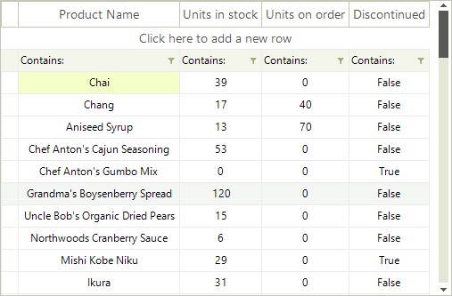
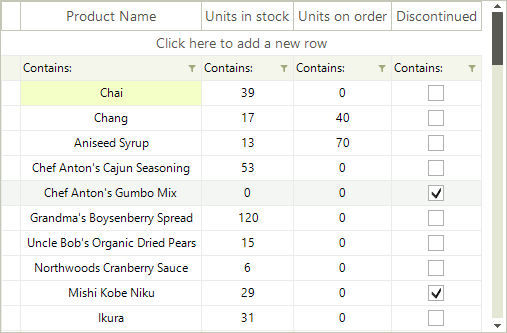

# Custom data cell 

__RadVirtualGrid__ provides a convenient way to create custom cells. __RadVirtualGrid__ supports a powerful and flexible mechanism for creating cell types with custom content elements, functionality and properties.

|Default VirtualGridCellElement for the *Discontinued* column|Custom VirtualGridCheckBoxCellElement for the *Discontinued* column|
|----|----|
|||

You can use the following approach to create a custom data cell with a check box in it:

1\. Create a class for the cell which derives from __VirtualGridCellElement__.

2\. Create the __RadCheckBoxElement__ and add it as a child of the custom cell. You can achieve this by overriding the __CreateChildElements__ method.

3\. Override the __UpdateInfo__ method to update the check box according to the cell value.

4\. The custom cell will have no styles, because there are no defined styles for its type in the themes. You can apply the __VirtualGridCellElement__’s styles to it by defining its __ThemeEffectiveType__.

5\. Override the __IsCompatible__ method and return *true* only for the compatible column and rows. This will prevent the cell from being unintentionally reused by other columns.

>note Thanks to the UI virtualization mechanism of __RadVirtualGrid__, only the currently visible cells are created and they are further reused when needed during operations like scrolling, filtering, etc. It is necessary to specify that our custom cell is applicable only to the desired column, e.g. ColumnIndex = 3. For this purpose, it is necessary to override the **IsCompatible** method and return *true* only if the cell is relevant for this column and row. This will ensure that the custom cell will be used only in this particular column and it won't be reused in other columns. However, the cell elements belonging to the rest of the columns, by default, are applicable to the custom column as well. This requires creating a default VirtualGridCellElement which IsCompatible with all the columns but our custom column with ColumnIndex = 3.

 A cell element is reused in other rows or columns if it is compatible for them. 

6\. In order to center the check box within the cell element, you should override the __ArrangeOverride__ method and arrange the __RadCheckBoxElement__ in the middle.

7\. Subscribe to the RadCheckBoxElement.__ToggleStateChanged__ event in order to synchronize the cell's value with the check box.

#### Custom VirtualGridCellElement

<snippet id='virtualgrid-virtualgridcustomcells-customcell-cs' />
<snippet id='virtualgrid-virtualgridcustomcells-customcell-vb' />

8\. Once, you are ready with the implementation for the custom data cell, you should create the default cell:

<snippet id='virtualgrid-virtualgridcustomcells-usingdefaultcustomcell-cs' />
<snippet id='virtualgrid-virtualgridcustomcells-usingdefaultcustomcell-vb' />

9\. Subscribe to the __CreateCellElement__ event where we should replace the default __VirtualGridCellElement__ with the custom one:

#### Apply the custom cell

<snippet id='virtualgrid-virtualgridcustomcells-applycustomcell-cs' />
<snippet id='virtualgrid-virtualgridcustomcells-applycustomcell-vb' />

9\. Register the custom cell for the specified column index:

<snippet id='virtualgrid-virtualgridcustomcells-registercustomcolumn-cs' />
<snippet id='virtualgrid-virtualgridcustomcells-registercustomcolumn-vb' />

>note Use the __UnregisterCustomColumn__ method if you need to unregister the custom cell for the specified column index. You can detect whether a custom cell is used for a certain column index by using the RadVirtualGrid.MasterViewInfo.__IsCustomColumn__ method.

10\. The last thing we need to do, is to prevent entering edit mode for the custom cell. For this purpose, cancel the __EditorRequired__ event:

#### Prevent entering edit mode

<snippet id='virtualgrid-virtualgridcustomcells-canceleditor-cs' />
<snippet id='virtualgrid-virtualgridcustomcells-canceleditor-vb' />

>note The __RadCheckBoxElement__ can be replaced with any other __RadElement__ according to the user's requirement.

# See Also
* [Formatting Data Cells]()

* [Formatting System Cells]()

* [ToolTips]()

* [Filter by using a CheckBox in RadVirtualGrid]()

