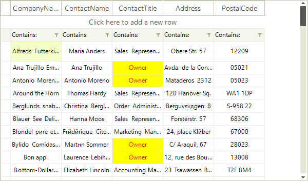

# Formatting Data Cells

The __CellFormatting__ event is used to add formatting to grid cells. For example, the code sample below changes the __ForeColor__, __BackColor__ and __GradientStyle__ in all data cells in the *ContactTitle* column if the cell value is *Owner*:

<snippet id='virtualgrid-virtualgridformattingcells-formattingcells-cs' />
<snippet id='virtualgrid-virtualgridformattingcells-formattingcells-vb' />

>caution Due to the UI virtualization in __RadVirtualGrid__, cell elements are created only for currently visible cells and are being reused during operations like scrolling, filtering, sorting and so on. In order to prevent applying the formatting to other columns' cell elements (because of the cell reuse) all customization should be reset for the rest of the cell elements.

# See Also
* [Creating custom cells]()

* [Formatting System Cells]()

* [ToolTips]()

