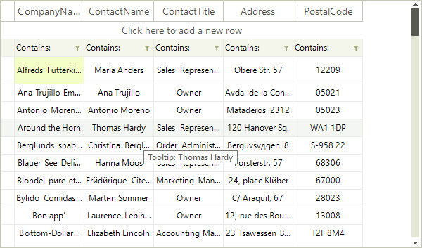
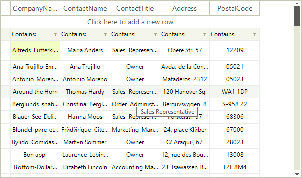

# ToolTips

There are two ways to assign tooltips to cells in __RadVirtualGrid__, namely setting the __ToolTipText__ property of a __VirtualGridCellElement__ in the __CellFormatting__ event handler, or as in most of the RadControls by using the __ToolTipTextNeeded__ event.

# Setting tooltips in the ToolTipTextNeeded event

The code snippet below demonstrates how you can use the __ToolTipTextNeeded__ event handler to set __ToolTipText__ for the given __VirtualGridCellElement__.

<snippet id='virtualgrid-virtualgridformattingcells-tooltiptextneeded-cs' />
<snippet id='virtualgrid-virtualgridformattingcells-tooltiptextneeded-vb' />

# Setting tooltips in the CellFormatting event handler  

The code snippet below demonstrates how you can assign a tooltip to a cell in __RadVirtualGrid__.

<snippet id='virtualgrid-virtualgridformattingcells-cellstooltips-cs' />
<snippet id='virtualgrid-virtualgridformattingcells-cellstooltips-vb' />

>note The __ToolTipTextNeeded__ event has higher priority and overrides the tooltips set in the __CellFormatting__ event handler.

# See Also
* [Creating custom cells]()

* [Formatting Data Cells]()

* [Formatting System Cells]()

