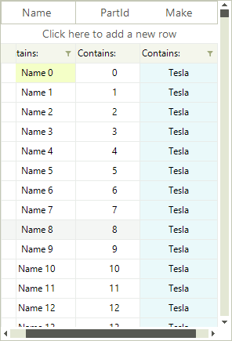

# Pinned Columns

__RadVirtualGrid__ columns can be pinned so that the rows appear anchored to the left or right of the grid. To pin a column you should use the __SetColumnPinPosition__ method where you just need to pass the column index and the desired pin position.

<snippet id='virtualgrid-pinned-cells-rows-pincolumn-cs' />
<snippet id='virtualgrid-pinned-cells-rows-pincolumn-vb' />

The result is that the column is pined to the right.

To unpin a row you just need to set its pin position to *none*.

<snippet id='virtualgrid-pinned-cells-rows-unpincolumn-cs' />
<snippet id='virtualgrid-pinned-cells-rows-unpincolumn-vb' />

# See Also
* [Resizing Columns Programmatically]()

