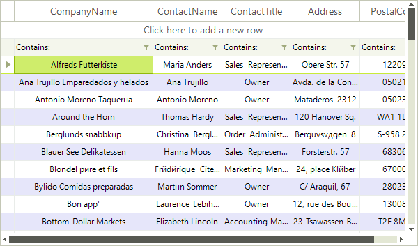

# Alternating Row Color

__RadVirtualGrid__ supports an alternating row color. It can be enabled by simply setting the __EnableAlternatingRowColor__ to *true*.

>caption Fig.1 Alternating Row color

<snippet id='virtualgrid-virtualgridrowsalternatingrowncolor-settings-cs' />
<snippet id='virtualgrid-virtualgridrowsalternatingrowncolor-settings-vb' />

# See Also
* [Formatting Data Rows]()

* [Formatting System Rows]()

* [Pinned Rows]()

* [Resizing Rows Programmatically]()

* [System Rows]()

