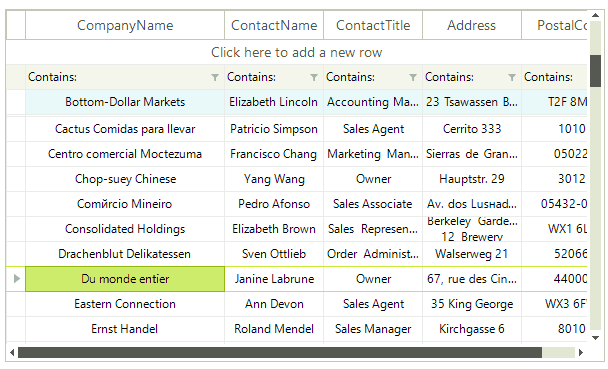

# Pinned Rows

__RadVirtualGrid__ rows can be pinned so that the rows appear anchored to the top or bottom of the grid. To pin a row you should use the __SetRowPinPosition__ method where you just need to pass the row index and the desired pin position.

<snippet id='virtualgrid-pinned-cells-rows-pinrow-cs' />
<snippet id='virtualgrid-pinned-cells-rows-pinrow-vb' />

The result is that the row is pined bellow the filter row.

To unpin a row you just need to set its pin position to *none*.

<snippet id='virtualgrid-pinned-cells-rows-unpinrow-cs' />
<snippet id='virtualgrid-pinned-cells-rows-unpinrow-vb' />

# See Also
* [Alternating Row Color]()

* [Formatting Data Rows]()

* [Formatting System Rows]()

* [Resizing Rows Programmatically]()

* [System Rows]()

