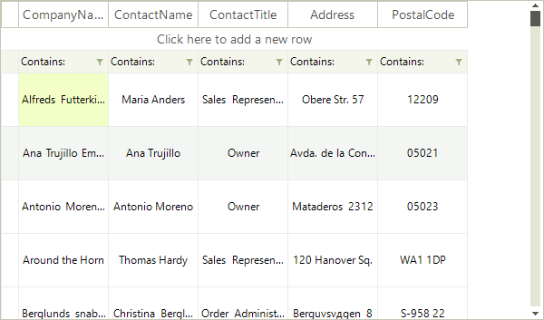

# Resizing Rows Programmatically

__RadVirtualGrid__ exposes an API allowing resizing of its rows. In order to utilize it we need to set the __AllowRowResize__ property to *true*.

<snippet id='virtualgrid-virtualgridresizingrows-allowrowresize-cs' />
<snippet id='virtualgrid-virtualgridresizingrows-allowrowresize-vb' />

## Resizing System Rows

The __VirtualGridViewInfo__ object exposes properties for directly accessing its system rows and setting a desired height.

>caption Figure 1 Resizing System Rows.

<snippet id='virtualgrid-virtualgridresizingrows-resizingsystemrows-cs' />
<snippet id='virtualgrid-virtualgridresizingrows-resizingsystemrows-vb' />

## Resizing Data Rows

The data rows can also be programmatically resized. __RadVirtualGrid.VirtualGridViewInfo__ provides a property for defining a uniform height to all rows and also methods for setting or retrieving the height of a single row.

>caption Figure 2 Resizing All Data Rows.

<snippet id='virtualgrid-virtualgridresizingrows-resizingdatarows-cs' />
<snippet id='virtualgrid-virtualgridresizingrows-resizingdatarows-vb' />

>caption Figure 3 Resizing A Single Data Row.

<snippet id='virtualgrid-virtualgridresizingrows-setrowheight-cs' />
<snippet id='virtualgrid-virtualgridresizingrows-setrowheight-vb' />

## Events

The API exposes two events for notifications when a change in the height of a row is about to happen or has already happened.

* __RowHeightChanging__: Raised before the operation starts, it can be canceled. The event arguments are:

     * __Cancel__: If set to *true* suspends the operation.

     * __NewHeight__: Value of the new row height.

     * __OldHeight__: Value of the old row height.

     * __RowIndex__: The index of the row which is about to be resized.
      
     * __ViewInfo__: Reference to the __VirtualGridViewInfo__ object.

* __RowHeightChanged__: Raised after the execution of the resizing operation. The event arguments are:

     * __RowIndex__: The index of the resized row.
      
     * __ViewInfo__: Reference to the __VirtualGridViewInfo__ object.

<snippet id='virtualgrid-virtualgridresizingrows-resizingevents-cs' />
<snippet id='virtualgrid-virtualgridresizingrows-resizingevents-vb' />

# See Also
* [Alternating Row Color]()

* [Formatting Data Rows]()

* [Formatting System Rows]()

* [Pinned Rows]()

* [System Rows]()

