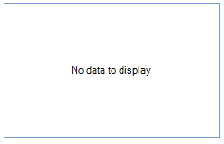

# Populating with data

__RadVirtualGrid__ is a control that allows you to display and edit tabular data from any kind of data source and large number of records. By default, no data is displayed in the grid. You can control whether the *no data* message will be shown by using the __ShowNoDataText__ property:

|ShowNoDataText = *true*|ShowNoDataText = *false*|
|----|----|
|||
 

In order to fill the grid with data, you should follow the steps below:

1\. Handle the __CellValueNeeded__ event. You should specify the __Value__ argument in the __VirtualGridCellValueNeededEventArgs__. 

2\. You will also need to set the __RowCount__ and __ColumnCount__ properties so that the grid will know how many rows/columns it needs to display.

The code snippet below demonstrates how to select data from the Northwind.Customers table stored in a mdb file. While reading the returned result, we fill a *List* of custom objects which is needed to track the number of records and sync the RadVirtualGrid. __RowCount__ property.


#### Populate with data

{{source=..\SamplesCS\VirtualGrid\VirtualGridPopulatingWithData.cs region=FillData}} 
{{source=..\SamplesVB\VirtualGrid\VirtualGridPopulatingWithData.vb region=FillData}} 

````C#
        
private string[] columnNames = new string[] { "CompanyName", "ContactName", "ContactTitle", "Address", "PostalCode" };
string connectionString = @"Provider=Microsoft.Jet.OLEDB.4.0;Data Source=" +
                          @"..\..\DataSources\Nwind.mdb;Persist Security Info=True";
List<Customer> data = new List<Customer>();
    
private void VirtualGridPopulatingWithData_Load(object sender, EventArgs e)
{
    this.radVirtualGrid1.CellValueNeeded += radVirtualGrid1_CellValueNeeded;
    this.radVirtualGrid1.ColumnCount = columnNames.Length;
    SelectData();
}
        
private void radVirtualGrid1_CellValueNeeded(object sender, VirtualGridCellValueNeededEventArgs e)
{
    if (e.ColumnIndex < 0)
        return;
    if (e.RowIndex == RadVirtualGrid.HeaderRowIndex)
    {
        e.Value = columnNames[e.ColumnIndex];
    }
    
    if (e.RowIndex < 0)
    {
        e.FieldName = columnNames[e.ColumnIndex];
    }
    
    if (e.RowIndex >= 0 && e.RowIndex < data.Count)
    {
        e.Value = data[e.RowIndex][e.ColumnIndex];
    }
}
    
private void SelectData()
{
    string selectCommand = "SELECT CustomerID, CompanyName, ContactName, ContactTitle, Address, PostalCode FROM Customers";
    using (System.Data.OleDb.OleDbCommand command = new System.Data.OleDb.OleDbCommand(selectCommand))
    {
        command.Connection = new System.Data.OleDb.OleDbConnection(connectionString);
        command.Connection.Open();
        IDataReader reader = command.ExecuteReader();
        data.Clear();
                
        while (reader.Read())
        {
            Customer customer = new Customer(
                Convert.ToString(reader[0]),
                Convert.ToString(reader[1]),
                Convert.ToString(reader[2]),
                Convert.ToString(reader[3]),
                Convert.ToString(reader[4]),
                Convert.ToString(reader[5]));
            data.Add(customer);
        }
    
        command.Connection.Close();
    }
        
    this.radVirtualGrid1.RowCount = data.Count;
}

````
````VB.NET
Private columnNames As String() = New String() {"CompanyName", "ContactName", "ContactTitle", "Address", "PostalCode"}
Dim connectionString As String = "Provider=Microsoft.Jet.OLEDB.4.0;Data Source=" + _
"..\..\DataSources\Nwind.mdb;Persist Security Info=True"
Private data As New List(Of Customer)()
Private Sub VirtualGridPopulatingWithData_Load(sender As Object, e As EventArgs) Handles Me.Load
    AddHandler Me.radVirtualGrid1.CellValueNeeded, AddressOf radVirtualGrid1_CellValueNeeded
    Me.radVirtualGrid1.ColumnCount = columnNames.Length
    SelectData()
End Sub
Private Sub radVirtualGrid1_CellValueNeeded(sender As Object, e As VirtualGridCellValueNeededEventArgs)
    If e.ColumnIndex < 0 Then
        Return
    End If
    If e.RowIndex = RadVirtualGrid.HeaderRowIndex Then
        e.Value = columnNames(e.ColumnIndex)
    End If
    If e.RowIndex < 0 Then
        e.FieldName = columnNames(e.ColumnIndex)
    End If
    If e.RowIndex >= 0 AndAlso e.RowIndex < data.Count Then
        e.Value = data(e.RowIndex)(e.ColumnIndex)
    End If
End Sub
Private Sub SelectData()
    Dim selectCommand As String = "SELECT CustomerID, CompanyName, ContactName, ContactTitle, Address, PostalCode FROM Customers"
    Using command As New System.Data.OleDb.OleDbCommand(selectCommand)
        command.Connection = New System.Data.OleDb.OleDbConnection(connectionString)
        command.Connection.Open()
        Dim reader As IDataReader = command.ExecuteReader()
        data.Clear()
        While reader.Read()
            Dim customer As New Customer(Convert.ToString(reader(0)), Convert.ToString(reader(1)), Convert.ToString(reader(2)), _
                                         Convert.ToString(reader(3)), Convert.ToString(reader(4)), Convert.ToString(reader(5)))
            data.Add(customer)
        End While
        command.Connection.Close()
    End Using
    Me.radVirtualGrid1.RowCount = data.Count
End Sub

````

{{endregion}} 

#### Customer class

{{source=..\SamplesCS\VirtualGrid\VirtualGridPopulatingWithData.cs region=CustomerClass}} 
{{source=..\SamplesVB\VirtualGrid\VirtualGridPopulatingWithData.vb region=CustomerClass}} 
````C#
    
public class Customer
{
    public string CustomerId { get; set; }
    
    public string CompanyName { get; set; }
    
    public string ContactName { get; set; }
    
    public string ContactTitle { get; set; }
    
    public string Address { get; set; }
    
    public string PostalCode { get; set; }
        
    public Customer(string customerId, string companyName, string contactName,
        string contactTitle, string address, string postalCode)
    {
        this.CustomerId = customerId;
        this.CompanyName = companyName;
        this.ContactName = contactName;
        this.ContactTitle = contactTitle;
        this.Address = address;
        this.PostalCode = postalCode;
    }
            
    public string this[int i]
    {
        get
        {
            switch (i)
            {
                case 0:
                    return CompanyName;
                case 1:
                    return ContactName;
                case 2:
                    return ContactTitle;
                case 3:
                    return Address;
                case 4:
                    return PostalCode;
                default:
                    return String.Empty;
            }
        }
    }
}

````
````VB.NET
    
Public Class Customer
    Public Property CustomerId() As String
        Get
            Return m_CustomerId
        End Get
        Set(value As String)
            m_CustomerId = value
        End Set
    End Property
    Private m_CustomerId As String
    Public Property CompanyName() As String
        Get
            Return m_CompanyName
        End Get
        Set(value As String)
            m_CompanyName = value
        End Set
    End Property
    Private m_CompanyName As String
    Public Property ContactName() As String
        Get
            Return m_ContactName
        End Get
        Set(value As String)
            m_ContactName = value
        End Set
    End Property
    Private m_ContactName As String
    Public Property ContactTitle() As String
        Get
            Return m_ContactTitle
        End Get
        Set(value As String)
            m_ContactTitle = value
        End Set
    End Property
    Private m_ContactTitle As String
    Public Property Address() As String
        Get
            Return m_Address
        End Get
        Set(value As String)
            m_Address = value
        End Set
    End Property
    Private m_Address As String
    Public Property PostalCode() As String
        Get
            Return m_PostalCode
        End Get
        Set(value As String)
            m_PostalCode = value
        End Set
    End Property
    Private m_PostalCode As String
    Public Sub New(customerId As String, companyName As String, contactName As String, _
    contactTitle As String, address As String, postalCode As String)
        Me.CustomerId = customerId
        Me.CompanyName = companyName
        Me.ContactName = contactName
        Me.ContactTitle = contactTitle
        Me.Address = address
        Me.PostalCode = postalCode
    End Sub
    Default Public ReadOnly Property Item(i As Integer) As String
        Get
            Select Case i
                Case 0
                    Return CompanyName
                Case 1
                    Return ContactName
                Case 2
                    Return ContactTitle
                Case 3
                    Return Address
                Case 4
                    Return PostalCode
                Case Else
                    Return [String].Empty
            End Select
        End Get
    End Property
End Class

````

{{endregion}} 


 

# See Also
* [Handle Add, Delete and Update of Rows]()

